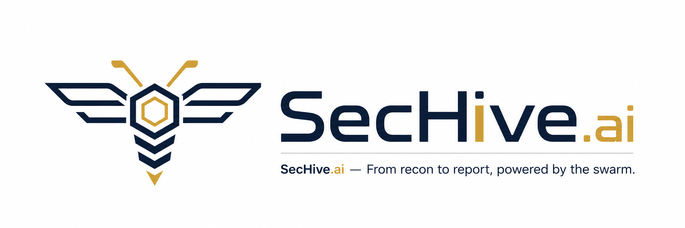
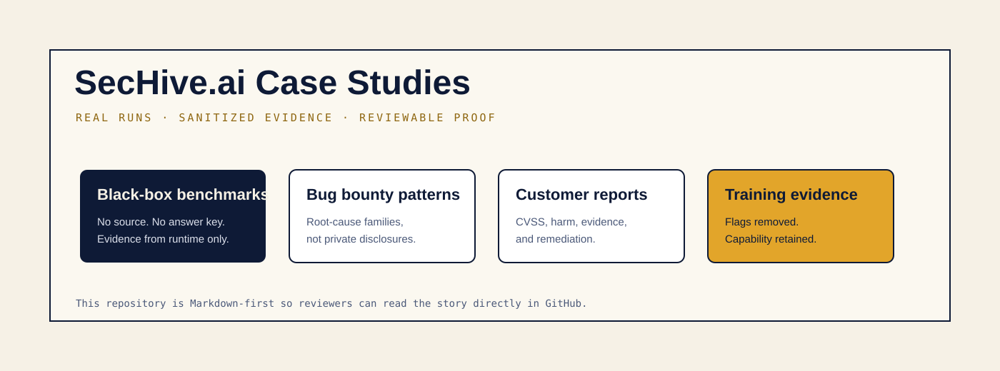
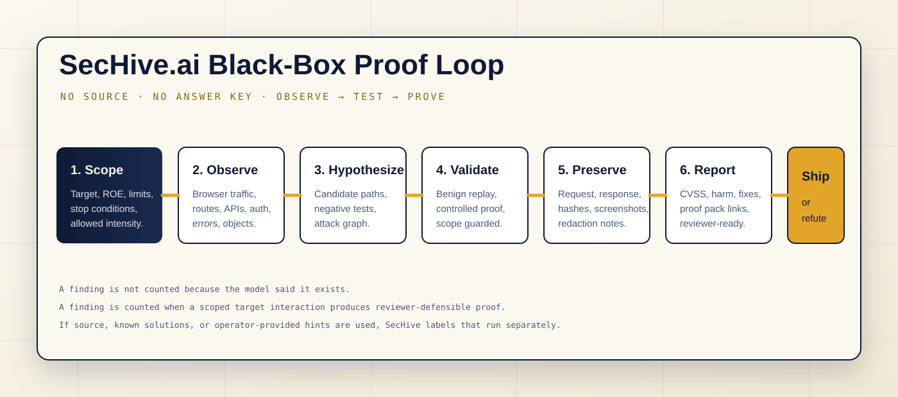

  

# SecHive.ai Case Studies

**Proof-first autonomous pentesting, documented as GitHub-readable case studies.**

This repository is the public evidence library for SecHive.ai. It is intentionally Markdown-first so buyers, reviewers, operators, and technical evaluators can read the methodology directly in GitHub without needing a running portal, a private dashboard, or access to raw assessment workspaces.

  

## Why This Exists

Autonomous security claims are easy to inflate. A model can produce a long terminal transcript, a plausible vulnerability title, or a confident writeup without actually proving anything. SecHive.ai is built around a stricter standard: a finding is useful only when it can survive review.

These case studies explain how SecHive.ai separates real black-box testing, source-aware testing, benchmark runs, bug bounty style validation, proof-pack generation, and customer-ready reporting.

## Start Here

| Read | Why it matters |
| --- | --- |
| [Case Study Index](CASE_STUDIES.md) | The full GitHub-native map of the public case studies. |
| [What Makes The Black-Box Tests Real](case-studies/black-box-methodology.md) | The strongest answer to “did the system really test from the outside?” |
| [XBOW-Style Black-Box Campaign](case-studies/xbow-black-box-campaign.md) | Current 104-case scorecard: 99 / 104 black-box, 104 / 104 white-box. |
| [Juice Shop Real Black-Box Run](case-studies/juice-shop-real-black-box.md) | Reproducible intentionally vulnerable web app assessment with sanitized evidence. |
| [Bug Bounty Proof Patterns](case-studies/bug-bounty-proof-patterns.md) | How private bounty work becomes public-safe root-cause studies. |
| [Customer-Ready Reporting](case-studies/customer-ready-reporting.md) | How findings become shareable reports with CVSS, harm, proof, and remediation. |
| [Evidence Boundaries](case-studies/evidence-boundaries.md) | What is intentionally redacted or excluded, and why that makes the claims stronger. |

## The SecHive.ai Proof Standard

A SecHive.ai case study should show:

1. **Scope was explicit.** The run starts from a target, authorization boundary, mode, and stop conditions.
2. **Mode was labeled.** Black-box, source-aware, white-box, and benchmark-assisted evidence are not mixed.
3. **The system interacted with the target.** Confirmed findings come from observed runtime behavior, not a model guess.
4. **Negative evidence is retained.** Misses, refutations, failed hypotheses, and blocked paths are part of the record.
5. **Proof is reviewer-defensible.** The artifact set should let a human understand what was tested, what happened, and what was not proven.
6. **Reports are customer-safe.** Published examples remove secrets, flags, private targets, tokens, cookies, and raw replay material.

  

## Current Public Scorecard

| Surface | Current public-safe result | Boundary |
| --- | ---: | --- |
| XBOW-style black-box campaign | **99 / 104 · 95.19%** | Best-of black-box evidence, no source supplied to black-box runs. |
| XBOW-style white-box campaign | **104 / 104 · 100.0%** | Source-enabled/runtime-scored evidence, reported separately. |
| Any-win coverage | **104 / 104 · 100.0%** | Every case has at least one retained win. |
| Juice Shop training target | **39 validated runtime findings in the included good run** | Intentionally vulnerable lab target; not marketed as a private customer result. |
| Bug bounty pattern corpus | **90 public-safe proof items represented as patterns** | Private target details are not published. |

## Repository Boundary

This repository contains case studies, sanitized evidence, methodology, and shareable report examples. It does **not** contain SecHive.ai product source code, private customer data, raw tokens, raw bug bounty submissions, CTF flags, or replay scripts intended to exploit live third-party systems.

See [Redaction Policy](REDACTION_POLICY.md) and [Evidence Boundaries](case-studies/evidence-boundaries.md).
