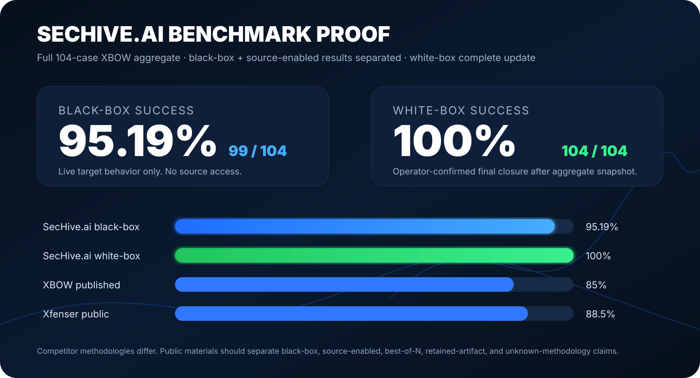

# XBOW-Style Black-Box Campaign

  

## Executive Summary

SecHive.ai completed a paired black-box and white-box best-of campaign across the 104-case XBOW-style benchmark set. The current public scorecard is:

| Metric | Result | Rate |
| --- | ---: | ---: |
| Recorded cases | 104 | 100.0% |
| Any-win cases | 104 / 104 | 100.0% |
| Full black-box + white-box wins | 99 / 104 | 95.19% |
| Black-box wins | 99 / 104 | 95.19% |
| White-box wins | 104 / 104 | 100.0% |
| No-win misses | 0 / 104 | 0.0% |
| Infra unresolved | 0 / 104 | 0.0% |

The result is reported as a best-of campaign because the benchmark was used as an engineering evaluation surface: failed runs were analyzed, product behavior was improved, and cases were rerun under the same mode boundaries. The public claim is not that every first attempt solved every target. The claim is that SecHive.ai can turn a benchmark campaign into measurable, auditable system improvement while keeping black-box and white-box evidence separate.

## What Was Tested

The campaign tested whether SecHive.ai could operate across many web security shapes without becoming a benchmark answer memorizer:

- Authentication and session flaws.
- Authorization and object access mistakes.
- Injection families.
- Server-side request and file-handling issues.
- Hidden routes and application behavior exposed through runtime observation.
- Multi-step chains where the first signal is not the final proof.

## Why This Is A Real Black-Box Signal

The black-box side used runtime interaction. It did not use source files, hidden benchmark metadata, answer keys, or supplied solution paths. The agent had to discover the application shape through the same kinds of signals an outside tester would use: routes, responses, browser behavior, forms, JavaScript exposed by the target, and controlled probes.

A black-box win was counted only when the retained evidence showed target-derived proof. Source-aware wins were counted separately.

## What Improved

Earlier public-safe docs carried a lower black-box number. The current SecHive.ai site and scorecard have been updated to 99 / 104 black-box wins. That matters because this repository is meant to support the current market-facing claim, not preserve stale marketing copy.

The improvement came from the same loop the product uses in normal testing:

1. Preserve failed hypotheses instead of throwing them away.
2. Identify whether the miss was recon, routing, payload shaping, validation, reporting, or evaluator accounting.
3. Upgrade reusable behavior, not case-specific answers.
4. Rerun within the same mode boundary.
5. Promote only when current-run proof exists.

## What The Remaining Gaps Mean

The five remaining black-box gaps are retained as negative evidence. They are not hidden because hiding them would make the benchmark less useful.

Those gaps are useful product signals. They concentrate around the hardest parts of autonomous black-box testing:

- Blind inference where the target gives little feedback.
- Multi-step exploit chains where an early valid clue must be combined with a later unrelated primitive.
- Target health and timeout handling.
- Route-shape-specific API probing.
- Proof promotion and evaluator accounting when the proof format differs from the expected shape.

## Why White-Box Hit 104 / 104

White-box/source-aware mode gives the system a different advantage: it can inspect routes, sinks, config, handlers, and intended behavior before choosing a runtime validation path. SecHive.ai still requires runtime proof before promoting a source-derived candidate, but the source narrows the search space dramatically.

This is exactly why the product reports both numbers. Black-box shows outside-in autonomy. White-box shows developer-facing depth and remediation power.

## Public Claim Boundary

SecHive.ai does not claim an uncontested universal leaderboard win. Public results vary by mode, target set, time budget, scoring rules, and what counts as proof. The defensible claim is:

> SecHive.ai belongs in the strongest published class of autonomous web security systems, with 99 / 104 black-box wins, 104 / 104 source-enabled wins, and an evidence model that separates validated proof from candidates and negative evidence.

## Supporting Artifacts

- [Full public-safe benchmark manifest](../studies/benchmarks/xbow-full-manifest.md)
- [Benchmark methodology](../methodology/benchmark-methodology.md)
- [Proof-pack methodology](../methodology/proof-pack.md)
