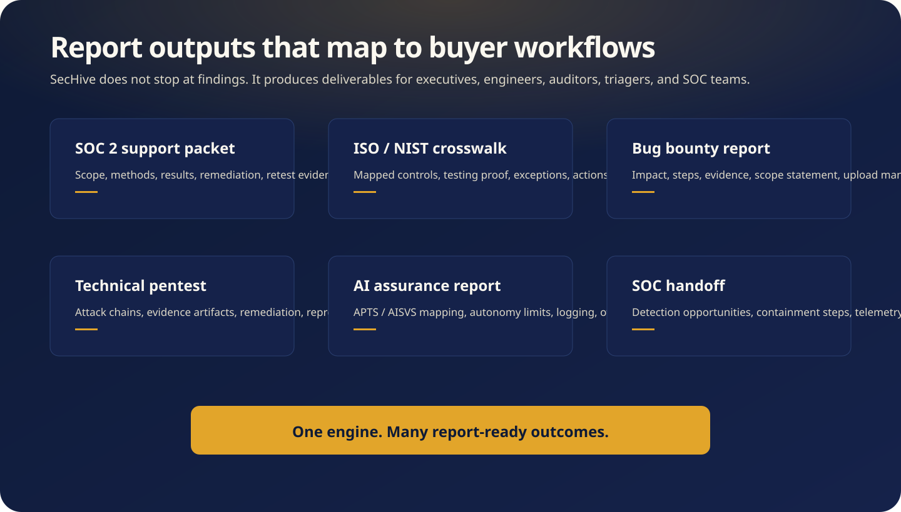

  

# OWASP Juice Shop Security Assessment

**Customer-readable sanitized report artifact**

This Markdown report replaces the raw generated dump for GitHub viewing. It preserves the finding inventory, evidence boundaries, severity, likely harm, and remediation themes without embedding huge HTML responses, broken image references, local filesystem paths, tokens, or training-target secrets.

  

## Executive Summary

SecHive.ai assessed a reproducible OWASP Juice Shop training target in black-box pentest mode and validated **39 runtime findings**. The run demonstrates the SecHive.ai proof-first workflow: discover externally visible behavior, form hypotheses, validate with scoped target interactions, preserve proof material, and produce a reviewable report.

This is intentionally framed as a **training-target case study**, not a private customer pentest. Juice Shop is an intentionally vulnerable application, which makes it useful for demonstrating breadth, reporting quality, and evidence handling without disclosing customer data.

## Scorecard

| Metric | Result |
| --- | ---: |
| Validated runtime findings | 39 |
| Critical findings | 3 |
| High findings | 18 |
| Medium findings | 18 |
| Low findings | 0 |
| Proof-pack artifacts referenced by source JSON | 40 |
| Source-aware candidates | 0 |
| Public-safe status | Sanitized for GitHub |

## Mode and Boundary

| Field | Value |
| --- | --- |
| Mode | `pentest` |
| Target | `[REDACTED_HOST]` |
| Run ID | `501a6113-98ce-4887-bd1b-9386fdc71a5f` |
| Workspace | `pentest-cfac770dd387` |
| Evidence publication | Raw proof paths, tokens, local IPs, and large response bodies redacted |
| Claim boundary | Demonstrates SecHive.ai workflow on an intentionally vulnerable benchmark target |

## Finding Distribution

| Severity | Count | CVSS Band Used In This Public Report |
| --- | ---: | --- |
| Critical | 3 | 9.0-10.0 |
| High | 18 | 7.0-8.9 |
| Medium | 18 | 4.0-6.9 |
| Low | 0 | 0.1-3.9 |
| Informational | 0 | 0.0 |

## Findings By Theme

| Theme | Count | Why It Matters |
| --- | ---: | --- |
| Authentication and secrets | 7 | Shows credential, token, password-hash, enumeration, and session-risk coverage. |
| Authorization and business logic | 12 | Shows object access, role control, workflow abuse, and business logic testing beyond banner scanning. |
| Client/server trust boundary | 4 | Shows browser, API, JSONP, XSS, and SSRF style trust-boundary analysis. |
| Exposure and hardening | 9 | Shows discovery of sensitive endpoints, public files, metrics, documentation, and configuration leaks. |
| Injection and parser abuse | 6 | Shows ability to identify data access, parser, and command-adjacent weakness classes from runtime behavior. |
| Other | 1 | Requires case-by-case engineering review. |

## Full Finding Inventory

| # | Severity | Finding | Category | CVSS Band | Potential Harm |
| ---: | --- | --- | --- | --- | --- |
| 1 | Critical | Admin role injection during registration | Authorization and business logic | 9.0-10.0 | Unauthorized access or modification of another user, role, object, or privileged workflow. |
| 2 | Critical | SQL injection authentication bypass: POST /rest/user/login | Injection and parser abuse | 9.0-10.0 | Data extraction, authentication bypass, and full application compromise if chained with exposed administrative functions. |
| 3 | Critical | SQL injection data extraction signal: GET /rest/products/search | Injection and parser abuse | 9.0-10.0 | Data extraction, authentication bypass, and full application compromise if chained with exposed administrative functions. |
| 4 | High | Authenticated API response exposes password hash field | Authentication and secrets | 7.0-8.9 | Credential exposure, session compromise, account takeover, or downstream cracking and replay risk. |
| 5 | High | Brute-force protection gap: POST /Login | Authentication and secrets | 7.0-8.9 | Account discovery and credential attack acceleration. |
| 6 | High | Cross-user basket checkout signal | Authorization and business logic | 7.0-8.9 | Unauthorized access or modification of another user, role, object, or privileged workflow. |
| 7 | High | Cross-user basket item modification signal | Authorization and business logic | 7.0-8.9 | Unauthorized access or modification of another user, role, object, or privileged workflow. |
| 8 | High | Deluxe membership workflow bypass signal | Authorization and business logic | 7.0-8.9 | Security control bypass or sensitive behavior exposure requiring engineering review. |
| 9 | High | Exposed hardcoded client credentials in static bundle | Authentication and secrets | 7.0-8.9 | Credential exposure, session compromise, account takeover, or downstream cracking and replay risk. |
| 10 | High | IDOR signal: GET /api/Feedbacks/:id | Authorization and business logic | 7.0-8.9 | Unauthorized access or modification of another user, role, object, or privileged workflow. |
| 11 | High | IDOR signal: GET /api/Users/:id | Authorization and business logic | 7.0-8.9 | Unauthorized access or modification of another user, role, object, or privileged workflow. |
| 12 | High | IDOR signal: GET /rest/basket/:id | Authorization and business logic | 7.0-8.9 | Unauthorized access or modification of another user, role, object, or privileged workflow. |
| 13 | High | NoSQL operator injection signal: PATCH /rest/products/reviews | Injection and parser abuse | 7.0-8.9 | Data extraction, authentication bypass, and full application compromise if chained with exposed administrative functions. |
| 14 | High | Regular user product creation authorization signal | Authorization and business logic | 7.0-8.9 | Unauthorized access or modification of another user, role, object, or privileged workflow. |
| 15 | High | SSRF internal fetch signal: /profile/image/url | Client/server trust boundary | 7.0-8.9 | Server-side network pivoting, internal endpoint access, metadata exposure, or trusted-origin abuse. |
| 16 | High | Session token replay signal after logout | Authentication and secrets | 7.0-8.9 | Credential exposure, session compromise, account takeover, or downstream cracking and replay risk. |
| 17 | High | Unauthenticated sensitive endpoint exposure: GET /rest/admin/application-configuration | Authorization and business logic | 7.0-8.9 | Unauthorized access or modification of another user, role, object, or privileged workflow. |
| 18 | High | Unauthenticated sensitive endpoint exposure: GET /rest/admin/application-version | Authorization and business logic | 7.0-8.9 | Unauthorized access or modification of another user, role, object, or privileged workflow. |
| 19 | High | Unauthenticated sensitive endpoint exposure: GET /rest/memories | Exposure and hardening | 7.0-8.9 | Security control bypass or sensitive behavior exposure requiring engineering review. |
| 20 | High | Weak MD5 password hash cracking signal | Authentication and secrets | 7.0-8.9 | Credential exposure, session compromise, account takeover, or downstream cracking and replay risk. |
| 21 | High | XXE file disclosure signal: POST /file-upload | Injection and parser abuse | 7.0-8.9 | Sensitive file disclosure, local file read exposure, or unsafe public artifact access. |
| 22 | Medium | Account enumeration signal: GET /rest/user/security-question | Authentication and secrets | 4.0-6.9 | Account discovery and credential attack acceleration. |
| 23 | Medium | Admin-route access unlocked by the bypass | Authorization and business logic | 4.0-6.9 | Unauthorized access or modification of another user, role, object, or privileged workflow. |
| 24 | Medium | Client-side reflected XSS sink signal: #/search | Client/server trust boundary | 4.0-6.9 | Client-side code execution, session theft risk, or cross-origin data disclosure depending on user context. |
| 25 | Medium | JSONP callback execution surface: GET /rest/user/whoami | Client/server trust boundary | 4.0-6.9 | Client-side code execution, session theft risk, or cross-origin data disclosure depending on user context. |
| 26 | Medium | Public API documentation exposure | Exposure and hardening | 4.0-6.9 | Reconnaissance acceleration and sensitive implementation detail exposure. |
| 27 | Medium | Public admin configuration disclosure | Authorization and business logic | 4.0-6.9 | Unauthorized access or modification of another user, role, object, or privileged workflow. |
| 28 | Medium | Public file disclosure | Exposure and hardening | 4.0-6.9 | Sensitive file disclosure, local file read exposure, or unsafe public artifact access. |
| 29 | Medium | Public metrics endpoint exposes runtime telemetry | Exposure and hardening | 4.0-6.9 | Reconnaissance acceleration and sensitive implementation detail exposure. |
| 30 | Medium | Public user secret disclosure | Authentication and secrets | 4.0-6.9 | Credential exposure, session compromise, account takeover, or downstream cracking and replay risk. |
| 31 | Medium | SQL injection login bypass to admin | Injection and parser abuse | 4.0-6.9 | Data extraction, authentication bypass, and full application compromise if chained with exposed administrative functions. |
| 32 | Medium | SSRF validation candidate: /profile/image/url | Client/server trust boundary | 4.0-6.9 | Server-side network pivoting, internal endpoint access, metadata exposure, or trusted-origin abuse. |
| 33 | Medium | Security header hardening gap | Other | 4.0-6.9 | Security control bypass or sensitive behavior exposure requiring engineering review. |
| 34 | Medium | Unauthenticated sensitive endpoint exposure: GET /ftp/ | Exposure and hardening | 4.0-6.9 | Sensitive file disclosure, local file read exposure, or unsafe public artifact access. |
| 35 | Medium | Unauthenticated sensitive endpoint exposure: GET /ftp/acquisitions.md | Exposure and hardening | 4.0-6.9 | Sensitive file disclosure, local file read exposure, or unsafe public artifact access. |
| 36 | Medium | Unauthenticated sensitive endpoint exposure: GET /ftp/announcement_encrypted.md | Exposure and hardening | 4.0-6.9 | Sensitive file disclosure, local file read exposure, or unsafe public artifact access. |
| 37 | Medium | Unauthenticated sensitive endpoint exposure: GET /ftp/incident-support.kdbx | Exposure and hardening | 4.0-6.9 | Sensitive file disclosure, local file read exposure, or unsafe public artifact access. |
| 38 | Medium | Unauthenticated sensitive endpoint exposure: GET /ftp/legal.md | Exposure and hardening | 4.0-6.9 | Sensitive file disclosure, local file read exposure, or unsafe public artifact access. |
| 39 | Medium | YAML parser resource-exhaustion signal: POST /file-upload | Injection and parser abuse | 4.0-6.9 | Sensitive file disclosure, local file read exposure, or unsafe public artifact access. |

## Priority Findings

These are the highest-risk findings from the run. Full detail for every finding appears in the next section.

### P1. Admin role injection during registration

- **Severity:** Critical (9.0-10.0)
- **Status:** validated
- **Confidence:** 0.92
- **Category:** Authorization and business logic
- **Potential harm:** Unauthorized access or modification of another user, role, object, or privileged workflow.
- **Evidence summary:** `POST http://[REDACTED_HOST]/api/Users` reflected/admin-confirmed elevated role assignment. Artifact: [REDACTED_PATH] Metadata: - Attempted: yes - Risk Tags: state-mutation, authz-bypass - Impact Bound: max 50 request(s) per vector; 15s request timeout; single canary mutation where required - State Changed: yes - Cleanup Attempted: no
- **Remediation:** Ignore client-supplied role fields and assign default least-privilege roles server-side only.

### P2. SQL injection authentication bypass: POST /rest/user/login

- **Severity:** Critical (9.0-10.0)
- **Status:** validated
- **Confidence:** 0.93
- **Category:** Injection and parser abuse
- **Potential harm:** Data extraction, authentication bypass, and full application compromise if chained with exposed administrative functions.
- **Evidence summary:** `POST http://[REDACTED_HOST]/rest/user/login` with a SQL tautology returned HTTP 200 and authentication markers. Artifact: [REDACTED_PATH] Metadata: - Attempted: yes - Risk Tags: state-mutation, credential-exposure, authz-bypass - Impact Bound: max 50 request(s) per vector; 15s request timeout; single canary mutation where required; capture proof material in run artifacts - State Changed: yes - Cleanup Attempted: no
- **Remediation:** Use parameterized queries or ORM-safe predicates for authentication and add negative tests for SQL metacharacters.

### P3. SQL injection data extraction signal: GET /rest/products/search

- **Severity:** Critical (9.0-10.0)
- **Status:** validated
- **Confidence:** 0.92
- **Category:** Injection and parser abuse
- **Potential harm:** Data extraction, authentication bypass, and full application compromise if chained with exposed administrative functions.
- **Evidence summary:** `GET http://[REDACTED_HOST]/rest/products/search?q=xxx%25%27%29%20AND%20description%20LIKE%20%27%25xxx%25%27%29%20UNION%20SELECT%20id,email,password,role,0,0,0,0,0%20FROM%20Users%20LIMIT%205--` returned user/email/password-hash markers. Artifact: [REDACTED_PATH] Metadata: - Attempted: yes - Risk Tags: state-mutation, credential-exposure, authz-bypass - Impact Bound: max 50 request(s) per vector; 15s request timeout; single canary mutation where required; capture proof material in run artifacts - State Changed: yes - Cleanup Attempted: no
- **Remediation:** Use strict parameter binding, reject unsafe query fragments, and remove SQL error/data leakage from responses.

### P4. Authenticated API response exposes password hash field

- **Severity:** High (7.0-8.9)
- **Status:** validated
- **Confidence:** 0.91
- **Category:** Authentication and secrets
- **Potential harm:** Credential exposure, session compromise, account takeover, or downstream cracking and replay risk.
- **Evidence summary:** `GET http://[REDACTED_HOST]/rest/user/whoami?fields=id,email,role,deluxeToken,password` exposed hash data. Artifact: [REDACTED_PATH] Metadata: - Attempted: yes - Risk Tags: persistence-adjacent, credential-exposure, authz-bypass - Impact Bound: max 50 request(s) per vector; 15s request timeout; harmless marker payload only; capture proof material in run artifacts - State Changed: yes - Cleanup Attempted: no
- **Remediation:** Never serialize password/passwordHash fields in API responses; enforce strict DTO allowlists.

### P5. Brute-force protection gap: POST /Login

- **Severity:** High (7.0-8.9)
- **Status:** validated
- **Confidence:** 0.8
- **Category:** Authentication and secrets
- **Potential harm:** Account discovery and credential attack acceleration.
- **Evidence summary:** 8 rapid failed attempts completed in 0.19s with statuses [200, 200, 200, 200, 200, 200, 200, 200]. Validation Metadata: - Attempted: yes - Risk Tags: state-mutation, rce-adjacent - Impact Bound: max 50 request(s) per vector; 15s request timeout; single canary mutation where required - State Changed: yes - Cleanup Attempted: no
- **Remediation:** Enforce account/IP rate limits, progressive backoff, and temporary lockouts on repeated failures.

### P6. Cross-user basket checkout signal

- **Severity:** High (7.0-8.9)
- **Status:** validated
- **Confidence:** 0.83
- **Category:** Authorization and business logic
- **Potential harm:** Unauthorized access or modification of another user, role, object, or privileged workflow.
- **Evidence summary:** `POST http://[REDACTED_HOST]/rest/basket/2/checkout` returned order confirmation markers. Artifact: [REDACTED_PATH] Metadata: - Attempted: yes - Risk Tags: state-mutation, credential-exposure - Impact Bound: max 50 request(s) per vector; 15s request timeout; single canary mutation where required; capture proof material in run artifacts - State Changed: yes - Cleanup Attempted: no
- **Remediation:** Bind checkout operations to the authenticated principal’s basket only.

### P7. Cross-user basket item modification signal

- **Severity:** High (7.0-8.9)
- **Status:** validated
- **Confidence:** 0.84
- **Category:** Authorization and business logic
- **Potential harm:** Unauthorized access or modification of another user, role, object, or privileged workflow.
- **Evidence summary:** `PUT http://[REDACTED_HOST]/api/BasketItems/1` returned HTTP 200 with updated quantity. Artifact: [REDACTED_PATH] Metadata: - Attempted: yes - Risk Tags: state-mutation, credential-exposure, authz-bypass - Impact Bound: max 50 request(s) per vector; 15s request timeout; single canary mutation where required; capture proof material in run artifacts - State Changed: yes - Cleanup Attempted: no
- **Remediation:** Authorize write operations against ownership/role policy before mutating basket items.

### P8. Deluxe membership workflow bypass signal

- **Severity:** High (7.0-8.9)
- **Status:** validated
- **Confidence:** 0.86
- **Category:** Authorization and business logic
- **Potential harm:** Security control bypass or sensitive behavior exposure requiring engineering review.
- **Evidence summary:** `POST http://[REDACTED_HOST]/rest/deluxe-membership` returned upgrade markers for a regular account. Artifact: [REDACTED_PATH] Metadata: - Attempted: yes - Risk Tags: state-mutation, authz-bypass - Impact Bound: max 50 request(s) per vector; 15s request timeout; single canary mutation where required - State Changed: yes - Cleanup Attempted: no
- **Remediation:** Enforce server-side payment and entitlement verification before role or membership upgrades.

### P9. Exposed hardcoded client credentials in static bundle

- **Severity:** High (7.0-8.9)
- **Status:** validated
- **Confidence:** 0.9
- **Category:** Authentication and secrets
- **Potential harm:** Credential exposure, session compromise, account takeover, or downstream cracking and replay risk.
- **Evidence summary:** `GET http://[REDACTED_HOST]/main.js` disclosed embedded credentials. Artifact: [REDACTED_PATH] Metadata: - Attempted: yes - Risk Tags: credential-exposure - Impact Bound: max 50 request(s) per vector; 15s request timeout; capture proof material in run artifacts - State Changed: no - Cleanup Attempted: no
- **Remediation:** Remove credentials from client-side code, rotate exposed secrets, and enforce build-time secret scanning.

### P10. IDOR signal: GET /api/Feedbacks/:id

- **Severity:** High (7.0-8.9)
- **Status:** validated
- **Confidence:** 0.86
- **Category:** Authorization and business logic
- **Potential harm:** Unauthorized access or modification of another user, role, object, or privileged workflow.
- **Evidence summary:** `GET http://[REDACTED_HOST]/api/Feedbacks/1` returned HTTP 200 with object data markers. Artifact: [REDACTED_PATH] Metadata: - Attempted: yes - Risk Tags: persistence-adjacent, credential-exposure, authz-bypass - Impact Bound: max 50 request(s) per vector; 15s request timeout; harmless marker payload only; capture proof material in run artifacts - State Changed: yes - Cleanup Attempted: no
- **Remediation:** Enforce object-level authorization on every user-scoped resource read and write path.

### P11. IDOR signal: GET /api/Users/:id

- **Severity:** High (7.0-8.9)
- **Status:** validated
- **Confidence:** 0.86
- **Category:** Authorization and business logic
- **Potential harm:** Unauthorized access or modification of another user, role, object, or privileged workflow.
- **Evidence summary:** `GET http://[REDACTED_HOST]/api/Users/2` returned HTTP 200 with object data markers. Artifact: [REDACTED_PATH] Metadata: - Attempted: yes - Risk Tags: credential-exposure, authz-bypass - Impact Bound: max 50 request(s) per vector; 15s request timeout; capture proof material in run artifacts - State Changed: no - Cleanup Attempted: no
- **Remediation:** Enforce object-level authorization on every user-scoped resource read and write path.

### P12. IDOR signal: GET /rest/basket/:id

- **Severity:** High (7.0-8.9)
- **Status:** validated
- **Confidence:** 0.86
- **Category:** Authorization and business logic
- **Potential harm:** Unauthorized access or modification of another user, role, object, or privileged workflow.
- **Evidence summary:** `GET http://[REDACTED_HOST]/rest/basket/1` returned HTTP 200 with object data markers. Artifact: [REDACTED_PATH] Metadata: - Attempted: yes - Risk Tags: credential-exposure, authz-bypass - Impact Bound: max 50 request(s) per vector; 15s request timeout; capture proof material in run artifacts - State Changed: no - Cleanup Attempted: no
- **Remediation:** Enforce object-level authorization on every user-scoped resource read and write path.

## Detailed Finding Notes

The following section keeps every finding readable without pasting raw response bodies. Reproduction and evidence fields are sanitized and shortened for public GitHub viewing.

### 1. Admin role injection during registration

| Field | Value |
| --- | --- |
| Severity | Critical |
| CVSS band | 9.0-10.0 |
| Status | validated |
| Confidence | 0.92 |
| Category | Authorization and business logic |
| Potential harm | Unauthorized access or modification of another user, role, object, or privileged workflow. |

**Summary:** Registration accepted a client-supplied admin role value.

**Sanitized evidence:** `POST http://[REDACTED_HOST]/api/Users` reflected/admin-confirmed elevated role assignment. Artifact: [REDACTED_PATH] Metadata: - Attempted: yes - Risk Tags: state-mutation, authz-bypass - Impact Bound: max 50 request(s) per vector; 15s request timeout; single canary mutation where required - State Changed: yes - Cleanup Attempted: no

**Safe reproduction context:** POST registration payload including `"role":"admin"` and observe successful privileged account creation.

**Recommended remediation:** Ignore client-supplied role fields and assign default least-privilege roles server-side only.

### 2. SQL injection authentication bypass: POST /rest/user/login

| Field | Value |
| --- | --- |
| Severity | Critical |
| CVSS band | 9.0-10.0 |
| Status | validated |
| Confidence | 0.93 |
| Category | Injection and parser abuse |
| Potential harm | Data extraction, authentication bypass, and full application compromise if chained with exposed administrative functions. |

**Summary:** Authentication accepted a SQL tautology payload and returned an authenticated-looking response.

**Sanitized evidence:** `POST http://[REDACTED_HOST]/rest/user/login` with a SQL tautology returned HTTP 200 and authentication markers. Artifact: [REDACTED_PATH] Metadata: - Attempted: yes - Risk Tags: state-mutation, credential-exposure, authz-bypass - Impact Bound: max 50 request(s) per vector; 15s request timeout; single canary mutation where required; capture proof material in run artifacts - State Changed: yes - Cleanup Attempted: no

**Safe reproduction context:** POST http://[REDACTED_HOST]/rest/user/login with JSON email/username payload `' OR 1=1--` and any password.

**Recommended remediation:** Use parameterized queries or ORM-safe predicates for authentication and add negative tests for SQL metacharacters.

### 3. SQL injection data extraction signal: GET /rest/products/search

| Field | Value |
| --- | --- |
| Severity | Critical |
| CVSS band | 9.0-10.0 |
| Status | validated |
| Confidence | 0.92 |
| Category | Injection and parser abuse |
| Potential harm | Data extraction, authentication bypass, and full application compromise if chained with exposed administrative functions. |

**Summary:** UNION-style input returned user credential/role fields, indicating data-exfiltration-capable SQL injection.

**Sanitized evidence:** `GET http://[REDACTED_HOST]/rest/products/search?q=xxx%25%27%29%20AND%20description%20LIKE%20%27%25xxx%25%27%29%20UNION%20SELECT%20id,email,password,role,0,0,0,0,0%20FROM%20Users%20LIMIT%205--` returned user/email/password-hash markers. Artifact: [REDACTED_PATH] Metadata: - Attempted: yes - Risk Tags: state-mutation, credential-exposure, authz-bypass - Impact Bound: max 50 request(s) per vector; 15s request timeout; single canary mutation where required; capture proof material in run artifacts - State Changed: yes - Cleanup Attempted: no

**Safe reproduction context:** GET http://[REDACTED_HOST]/rest/products/search?q=xxx%25%27%29%20AND%20description%20LIKE%20%27%25xxx%25%27%29%20UNION%20SELECT%20id,email,password,role,0,0,0,0,0%20FROM%20Users%20LIMIT%205--

**Recommended remediation:** Use strict parameter binding, reject unsafe query fragments, and remove SQL error/data leakage from responses.

### 4. Authenticated API response exposes password hash field

| Field | Value |
| --- | --- |
| Severity | High |
| CVSS band | 7.0-8.9 |
| Status | validated |
| Confidence | 0.91 |
| Category | Authentication and secrets |
| Potential harm | Credential exposure, session compromise, account takeover, or downstream cracking and replay risk. |

**Summary:** Profile endpoint returned password hash material to an authenticated client session.

**Sanitized evidence:** `GET http://[REDACTED_HOST]/rest/user/whoami?fields=id,email,role,deluxeToken,password` exposed hash data. Artifact: [REDACTED_PATH] Metadata: - Attempted: yes - Risk Tags: persistence-adjacent, credential-exposure, authz-bypass - Impact Bound: max 50 request(s) per vector; 15s request timeout; harmless marker payload only; capture proof material in run artifacts - State Changed: yes - Cleanup Attempted: no

**Safe reproduction context:** Authenticate, request whoami with explicit fields including password, and inspect response JSON.

**Recommended remediation:** Never serialize password/passwordHash fields in API responses; enforce strict DTO allowlists.

### 5. Brute-force protection gap: POST /Login

| Field | Value |
| --- | --- |
| Severity | High |
| CVSS band | 7.0-8.9 |
| Status | validated |
| Confidence | 0.8 |
| Category | Authentication and secrets |
| Potential harm | Account discovery and credential attack acceleration. |

**Summary:** Multiple rapid login attempts did not trigger visible rate-limit or lockout controls.

**Sanitized evidence:** 8 rapid failed attempts completed in 0.19s with statuses [200, 200, 200, 200, 200, 200, 200, 200]. Validation Metadata: - Attempted: yes - Risk Tags: state-mutation, rce-adjacent - Impact Bound: max 50 request(s) per vector; 15s request timeout; single canary mutation where required - State Changed: yes - Cleanup Attempted: no

**Safe reproduction context:** Send 8 failed login attempts to http://[REDACTED_HOST]/Login and confirm no 429/lockout response.

**Recommended remediation:** Enforce account/IP rate limits, progressive backoff, and temporary lockouts on repeated failures.

### 6. Cross-user basket checkout signal

| Field | Value |
| --- | --- |
| Severity | High |
| CVSS band | 7.0-8.9 |
| Status | validated |
| Confidence | 0.83 |
| Category | Authorization and business logic |
| Potential harm | Unauthorized access or modification of another user, role, object, or privileged workflow. |

**Summary:** Checkout succeeded for a fixed basket id, suggesting missing ownership checks on order execution.

**Sanitized evidence:** `POST http://[REDACTED_HOST]/rest/basket/2/checkout` returned order confirmation markers. Artifact: [REDACTED_PATH] Metadata: - Attempted: yes - Risk Tags: state-mutation, credential-exposure - Impact Bound: max 50 request(s) per vector; 15s request timeout; single canary mutation where required; capture proof material in run artifacts - State Changed: yes - Cleanup Attempted: no

**Safe reproduction context:** POST http://[REDACTED_HOST]/rest/basket/2/checkout with a non-owner token.

**Recommended remediation:** Bind checkout operations to the authenticated principal’s basket only.

### 7. Cross-user basket item modification signal

| Field | Value |
| --- | --- |
| Severity | High |
| CVSS band | 7.0-8.9 |
| Status | validated |
| Confidence | 0.84 |
| Category | Authorization and business logic |
| Potential harm | Unauthorized access or modification of another user, role, object, or privileged workflow. |

**Summary:** Authenticated basket-item update succeeded on a fixed object id, indicating possible write-level IDOR.

**Sanitized evidence:** `PUT http://[REDACTED_HOST]/api/BasketItems/1` returned HTTP 200 with updated quantity. Artifact: [REDACTED_PATH] Metadata: - Attempted: yes - Risk Tags: state-mutation, credential-exposure, authz-bypass - Impact Bound: max 50 request(s) per vector; 15s request timeout; single canary mutation where required; capture proof material in run artifacts - State Changed: yes - Cleanup Attempted: no

**Safe reproduction context:** PUT http://[REDACTED_HOST]/api/BasketItems/1 with a non-owner token and `{"quantity": 5}`.

**Recommended remediation:** Authorize write operations against ownership/role policy before mutating basket items.

### 8. Deluxe membership workflow bypass signal

| Field | Value |
| --- | --- |
| Severity | High |
| CVSS band | 7.0-8.9 |
| Status | validated |
| Confidence | 0.86 |
| Category | Authorization and business logic |
| Potential harm | Security control bypass or sensitive behavior exposure requiring engineering review. |

**Summary:** Deluxe membership upgrade endpoint accepted a direct request from a regular user without explicit payment proof.

**Sanitized evidence:** `POST http://[REDACTED_HOST]/rest/deluxe-membership` returned upgrade markers for a regular account. Artifact: [REDACTED_PATH] Metadata: - Attempted: yes - Risk Tags: state-mutation, authz-bypass - Impact Bound: max 50 request(s) per vector; 15s request timeout; single canary mutation where required - State Changed: yes - Cleanup Attempted: no

**Safe reproduction context:** Register/login as regular user, then POST an empty JSON body to `/rest/deluxe-membership`.

**Recommended remediation:** Enforce server-side payment and entitlement verification before role or membership upgrades.

### 9. Exposed hardcoded client credentials in static bundle

| Field | Value |
| --- | --- |
| Severity | High |
| CVSS band | 7.0-8.9 |
| Status | validated |
| Confidence | 0.9 |
| Category | Authentication and secrets |
| Potential harm | Credential exposure, session compromise, account takeover, or downstream cracking and replay risk. |

**Summary:** Static client bundle exposed plaintext credentials usable against the authentication endpoint.

**Sanitized evidence:** `GET http://[REDACTED_HOST]/main.js` disclosed embedded credentials. Artifact: [REDACTED_PATH] Metadata: - Attempted: yes - Risk Tags: credential-exposure - Impact Bound: max 50 request(s) per vector; 15s request timeout; capture proof material in run artifacts - State Changed: no - Cleanup Attempted: no

**Safe reproduction context:** Fetch client JavaScript bundles, extract exposed credentials, then authenticate via `/rest/user/login`.

**Recommended remediation:** Remove credentials from client-side code, rotate exposed secrets, and enforce build-time secret scanning.

### 10. IDOR signal: GET /api/Feedbacks/:id

| Field | Value |
| --- | --- |
| Severity | High |
| CVSS band | 7.0-8.9 |
| Status | validated |
| Confidence | 0.86 |
| Category | Authorization and business logic |
| Potential harm | Unauthorized access or modification of another user, role, object, or privileged workflow. |

**Summary:** Authenticated request returned cross-object data without visible ownership checks.

**Sanitized evidence:** `GET http://[REDACTED_HOST]/api/Feedbacks/1` returned HTTP 200 with object data markers. Artifact: [REDACTED_PATH] Metadata: - Attempted: yes - Risk Tags: persistence-adjacent, credential-exposure, authz-bypass - Impact Bound: max 50 request(s) per vector; 15s request timeout; harmless marker payload only; capture proof material in run artifacts - State Changed: yes - Cleanup Attempted: no

**Safe reproduction context:** GET http://[REDACTED_HOST]/api/Feedbacks/1 with a non-owner bearer token.

**Recommended remediation:** Enforce object-level authorization on every user-scoped resource read and write path.

### 11. IDOR signal: GET /api/Users/:id

| Field | Value |
| --- | --- |
| Severity | High |
| CVSS band | 7.0-8.9 |
| Status | validated |
| Confidence | 0.86 |
| Category | Authorization and business logic |
| Potential harm | Unauthorized access or modification of another user, role, object, or privileged workflow. |

**Summary:** Authenticated request returned cross-object data without visible ownership checks.

**Sanitized evidence:** `GET http://[REDACTED_HOST]/api/Users/2` returned HTTP 200 with object data markers. Artifact: [REDACTED_PATH] Metadata: - Attempted: yes - Risk Tags: credential-exposure, authz-bypass - Impact Bound: max 50 request(s) per vector; 15s request timeout; capture proof material in run artifacts - State Changed: no - Cleanup Attempted: no

**Safe reproduction context:** GET http://[REDACTED_HOST]/api/Users/2 with a non-owner bearer token.

**Recommended remediation:** Enforce object-level authorization on every user-scoped resource read and write path.

### 12. IDOR signal: GET /rest/basket/:id

| Field | Value |
| --- | --- |
| Severity | High |
| CVSS band | 7.0-8.9 |
| Status | validated |
| Confidence | 0.86 |
| Category | Authorization and business logic |
| Potential harm | Unauthorized access or modification of another user, role, object, or privileged workflow. |

**Summary:** Authenticated request returned cross-object data without visible ownership checks.

**Sanitized evidence:** `GET http://[REDACTED_HOST]/rest/basket/1` returned HTTP 200 with object data markers. Artifact: [REDACTED_PATH] Metadata: - Attempted: yes - Risk Tags: credential-exposure, authz-bypass - Impact Bound: max 50 request(s) per vector; 15s request timeout; capture proof material in run artifacts - State Changed: no - Cleanup Attempted: no

**Safe reproduction context:** GET http://[REDACTED_HOST]/rest/basket/1 with a non-owner bearer token.

**Recommended remediation:** Enforce object-level authorization on every user-scoped resource read and write path.

### 13. NoSQL operator injection signal: PATCH /rest/products/reviews

| Field | Value |
| --- | --- |
| Severity | High |
| CVSS band | 7.0-8.9 |
| Status | validated |
| Confidence | 0.86 |
| Category | Injection and parser abuse |
| Potential harm | Data extraction, authentication bypass, and full application compromise if chained with exposed administrative functions. |

**Summary:** Object-operator input in review update was accepted, indicating missing operator sanitization.

**Sanitized evidence:** `PATCH http://[REDACTED_HOST]/rest/products/reviews` accepted `$ne` operator-style payload. Artifact: [REDACTED_PATH] Metadata: - Attempted: yes - Risk Tags: state-mutation, persistence-adjacent - Impact Bound: max 50 request(s) per vector; 15s request timeout; single canary mutation where required; harmless marker payload only - State Changed: yes - Cleanup Attempted: no

**Safe reproduction context:** PATCH review endpoint using object/operator input in id selector.

**Recommended remediation:** Enforce strict schema validation for scalar fields and block operator objects in update selectors.

### 14. Regular user product creation authorization signal

| Field | Value |
| --- | --- |
| Severity | High |
| CVSS band | 7.0-8.9 |
| Status | validated |
| Confidence | 0.85 |
| Category | Authorization and business logic |
| Potential harm | Unauthorized access or modification of another user, role, object, or privileged workflow. |

**Summary:** Product creation endpoint accepted a non-admin token, indicating missing role enforcement.

**Sanitized evidence:** `POST http://[REDACTED_HOST]/api/Products` returned success for a regular account. Artifact: [REDACTED_PATH] Metadata: - Attempted: yes - Risk Tags: state-mutation, rce-adjacent, credential-exposure, authz-bypass - Impact Bound: max 50 request(s) per vector; 15s request timeout; single canary mutation where required; capture proof material in run artifacts - State Changed: yes - Cleanup Attempted: no

**Safe reproduction context:** Register/login as regular user and POST to product creation endpoint.

**Recommended remediation:** Restrict product-management endpoints to privileged roles with server-side policy checks.

### 15. SSRF internal fetch signal: /profile/image/url

| Field | Value |
| --- | --- |
| Severity | High |
| CVSS band | 7.0-8.9 |
| Status | validated |
| Confidence | 0.82 |
| Category | Client/server trust boundary |
| Potential harm | Server-side network pivoting, internal endpoint access, metadata exposure, or trusted-origin abuse. |

**Summary:** URL-ingestion endpoint accepted an internal application URL and returned internal-fetch response markers.

**Sanitized evidence:** `POST http://[REDACTED_HOST]/profile/image/url` with internal `imageUrl` returned application markers. Artifact: [REDACTED_PATH] Metadata: - Attempted: yes - Risk Tags: state-mutation, persistence-adjacent, authz-bypass - Impact Bound: max 50 request(s) per vector; 15s request timeout; single canary mutation where required; harmless marker payload only - State Changed: yes - Cleanup Attempted: no

**Safe reproduction context:** POST http://[REDACTED_HOST]/profile/image/url with `imageUrl` pointing to `http://[REDACTED_HOST]/rest/admin/application-version`.

**Recommended remediation:** Block private/link-local/internal destinations, enforce strict URL allowlists, and apply identical validation across HTTP methods.

### 16. Session token replay signal after logout

| Field | Value |
| --- | --- |
| Severity | High |
| CVSS band | 7.0-8.9 |
| Status | validated |
| Confidence | 0.79 |
| Category | Authentication and secrets |
| Potential harm | Credential exposure, session compromise, account takeover, or downstream cracking and replay risk. |

**Summary:** Bearer token remained usable after logout attempt, indicating weak server-side token invalidation controls.

**Sanitized evidence:** `GET http://[REDACTED_HOST]/rest/user/whoami` remained accessible with the same token after logout attempt. Artifact: [REDACTED_PATH] Metadata: - Attempted: yes - Risk Tags: persistence-adjacent, credential-exposure - Impact Bound: max 50 request(s) per vector; 15s request timeout; harmless marker payload only; capture proof material in run artifacts - State Changed: yes - Cleanup Attempted: no

**Safe reproduction context:** Authenticate, attempt logout, then re-use the same token on whoami/profile endpoint.

**Recommended remediation:** Implement token revocation or short-lived tokens with rotation and server-side invalidation checks.

### 17. Unauthenticated sensitive endpoint exposure: GET /rest/admin/application-configuration

| Field | Value |
| --- | --- |
| Severity | High |
| CVSS band | 7.0-8.9 |
| Status | validated |
| Confidence | 0.82 |
| Category | Authorization and business logic |
| Potential harm | Unauthorized access or modification of another user, role, object, or privileged workflow. |

**Summary:** Endpoint `/rest/admin/application-configuration` returned HTTP 200 without authentication.

**Sanitized evidence:** http://[REDACTED_HOST]/rest/admin/application-configuration returned HTTP 200 unauthenticated. Artifact: [REDACTED_PATH]

**Safe reproduction context:** GET http://[REDACTED_HOST]/rest/admin/application-configuration without authentication

**Recommended remediation:** Require authentication and authorization checks for sensitive endpoints and files.

### 18. Unauthenticated sensitive endpoint exposure: GET /rest/admin/application-version

| Field | Value |
| --- | --- |
| Severity | High |
| CVSS band | 7.0-8.9 |
| Status | validated |
| Confidence | 0.82 |
| Category | Authorization and business logic |
| Potential harm | Unauthorized access or modification of another user, role, object, or privileged workflow. |

**Summary:** Endpoint `/rest/admin/application-version` returned HTTP 200 without authentication.

**Sanitized evidence:** http://[REDACTED_HOST]/rest/admin/application-version returned HTTP 200 unauthenticated. Artifact: [REDACTED_PATH]

**Safe reproduction context:** GET http://[REDACTED_HOST]/rest/admin/application-version without authentication

**Recommended remediation:** Require authentication and authorization checks for sensitive endpoints and files.

### 19. Unauthenticated sensitive endpoint exposure: GET /rest/memories

| Field | Value |
| --- | --- |
| Severity | High |
| CVSS band | 7.0-8.9 |
| Status | validated |
| Confidence | 0.82 |
| Category | Exposure and hardening |
| Potential harm | Security control bypass or sensitive behavior exposure requiring engineering review. |

**Summary:** Sensitive-looking endpoint `/rest/memories` returned HTTP 200 without authentication.

**Sanitized evidence:** `GET http://[REDACTED_HOST]/rest/memories` returned HTTP 200. Artifact: [REDACTED_PATH] Metadata: - Attempted: yes - Risk Tags: none - Impact Bound: max 50 request(s) per vector; 15s request timeout - State Changed: no - Cleanup Attempted: no

**Safe reproduction context:** GET http://[REDACTED_HOST]/rest/memories

**Recommended remediation:** Require authentication and object-level authorization for sensitive API and file endpoints.

### 20. Weak MD5 password hash cracking signal

| Field | Value |
| --- | --- |
| Severity | High |
| CVSS band | 7.0-8.9 |
| Status | validated |
| Confidence | 0.89 |
| Category | Authentication and secrets |
| Potential harm | Credential exposure, session compromise, account takeover, or downstream cracking and replay risk. |

**Summary:** Leaked password hash was crackable with a short common-password dictionary.

**Sanitized evidence:** Leaked hash matched dictionary candidate `admin123`. Validation Metadata: - Attempted: yes - Risk Tags: credential-exposure, authz-bypass - Impact Bound: max 50 request(s) per vector; 15s request timeout; capture proof material in run artifacts - State Changed: no - Cleanup Attempted: no

**Safe reproduction context:** Hash common candidate passwords with MD5 and compare against leaked value.

**Recommended remediation:** Use adaptive password hashing (Argon2id/bcrypt/scrypt) with per-user salts and secret pepper controls.

### 21. XXE file disclosure signal: POST /file-upload

| Field | Value |
| --- | --- |
| Severity | High |
| CVSS band | 7.0-8.9 |
| Status | validated |
| Confidence | 0.86 |
| Category | Injection and parser abuse |
| Potential harm | Sensitive file disclosure, local file read exposure, or unsafe public artifact access. |

**Summary:** XML upload processing resolved external entities and exposed host file content markers.

**Sanitized evidence:** `POST http://[REDACTED_HOST]/file-upload` with XML entity payload returned filesystem markers. Artifact: [REDACTED_PATH] Metadata: - Attempted: yes - Risk Tags: state-mutation, server-local-read, persistence-adjacent - Impact Bound: max 50 request(s) per vector; 15s request timeout; single canary mutation where required; single local-read proof request; harmless marker payload only - State Changed: yes - Cleanup Attempted: no

**Safe reproduction context:** Upload XML containing external entity reference to a local file and inspect response.

**Recommended remediation:** Disable external entity resolution and DTD processing for all XML parsers.

### 22. Account enumeration signal: GET /rest/user/security-question

| Field | Value |
| --- | --- |
| Severity | Medium |
| CVSS band | 4.0-6.9 |
| Status | validated |
| Confidence | 0.81 |
| Category | Authentication and secrets |
| Potential harm | Account discovery and credential attack acceleration. |

**Summary:** Different password-reset/security-question responses indicate whether an account exists.

**Sanitized evidence:** Valid and invalid email probes produced distinct responses. Artifact: [REDACTED_PATH] Metadata: - Attempted: yes - Risk Tags: credential-exposure, authz-bypass - Impact Bound: max 50 request(s) per vector; 15s request timeout; capture proof material in run artifacts - State Changed: no - Cleanup Attempted: no

**Safe reproduction context:** GET http://[REDACTED_HOST]/rest/user/security-question?email=admin%40juice-sh.op vs GET http://[REDACTED_HOST]/rest/user/security-question?email=nonexistent.user.sechive%40example.invalid

**Recommended remediation:** Return identical response bodies and timing for valid/invalid account lookups.

### 23. Admin-route access unlocked by the bypass

| Field | Value |
| --- | --- |
| Severity | Medium |
| CVSS band | 4.0-6.9 |
| Status | validated |
| Confidence | 0.82 |
| Category | Authorization and business logic |
| Potential harm | Unauthorized access or modification of another user, role, object, or privileged workflow. |

**Summary:** A validated authentication or role bypass unlocked adjacent admin or privileged routes during the same run.

**Sanitized evidence:** Capability roll-up from already validated current-run findings: - Unauthenticated sensitive endpoint exposure: GET /rest/admin/application-configuration (high, validated) - Unauthenticated sensitive endpoint exposure: GET /rest/admin/application-version (high, validated) - SQL injection authentication bypass: POST /rest/user/login (critical, validated) - IDOR signal: GET /api/Users/:id (high, validated) - Admin role injection during registration (critical, validated) - SSRF internal fetch signal: /profile/image/url (high, validated)

**Safe reproduction context:** Replay the validated bypass, then compare unauthenticated and bypass-authenticated access to the recorded admin route.

**Recommended remediation:** Fix the underlying primitive findings in this capability chain and retest the chained access path.

### 24. Client-side reflected XSS sink signal: #/search

| Field | Value |
| --- | --- |
| Severity | Medium |
| CVSS band | 4.0-6.9 |
| Status | validated |
| Confidence | 0.76 |
| Category | Client/server trust boundary |
| Potential harm | Client-side code execution, session theft risk, or cross-origin data disclosure depending on user context. |

**Summary:** Client bundle contains search-route HTML trust bypass logic that can render query-controlled content.

**Sanitized evidence:** `GET http://[REDACTED_HOST]/main.js` contained search and `bypassSecurityTrustHtml` markers. Artifact: [REDACTED_PATH] Metadata: - Attempted: yes - Risk Tags: authz-bypass - Impact Bound: max 50 request(s) per vector; 15s request timeout - State Changed: no - Cleanup Attempted: no

**Safe reproduction context:** Navigate to `http://[REDACTED_HOST]/#/search?q=` and observe whether query content executes in browser context.

**Recommended remediation:** Remove trust-bypass rendering for user-controlled search values and enforce contextual output encoding.

### 25. JSONP callback execution surface: GET /rest/user/whoami

| Field | Value |
| --- | --- |
| Severity | Medium |
| CVSS band | 4.0-6.9 |
| Status | validated |
| Confidence | 0.8 |
| Category | Client/server trust boundary |
| Potential harm | Client-side code execution, session theft risk, or cross-origin data disclosure depending on user context. |

**Summary:** The endpoint reflects a callback name into executable JavaScript-style response content.

**Sanitized evidence:** `GET http://[REDACTED_HOST]/rest/user/whoami?callback=alert` returned callback execution markers. Artifact: [REDACTED_PATH] Metadata: - Attempted: yes - Risk Tags: none - Impact Bound: max 50 request(s) per vector; 15s request timeout - State Changed: no - Cleanup Attempted: no

**Safe reproduction context:** GET http://[REDACTED_HOST]/rest/user/whoami?callback=alert

**Recommended remediation:** Remove JSONP support where possible; otherwise restrict callback names and return JSON with CORS controls.

### 26. Public API documentation exposure

| Field | Value |
| --- | --- |
| Severity | Medium |
| CVSS band | 4.0-6.9 |
| Status | validated |
| Confidence | 0.84 |
| Category | Exposure and hardening |
| Potential harm | Reconnaissance acceleration and sensitive implementation detail exposure. |

**Summary:** `/api-docs` returned HTTP 200 with sensitive operational content.

**Sanitized evidence:** `GET http://[REDACTED_HOST]/api-docs` returned HTTP 200. Artifact: [REDACTED_PATH] Metadata: - Attempted: yes - Risk Tags: none - Impact Bound: max 50 request(s) per vector; 15s request timeout - State Changed: no - Cleanup Attempted: no

**Safe reproduction context:** GET http://[REDACTED_HOST]/api-docs

**Recommended remediation:** Restrict API documentation to trusted users or remove privileged routes from public docs.

### 27. Public admin configuration disclosure

| Field | Value |
| --- | --- |
| Severity | Medium |
| CVSS band | 4.0-6.9 |
| Status | validated |
| Confidence | 0.82 |
| Category | Authorization and business logic |
| Potential harm | Unauthorized access or modification of another user, role, object, or privileged workflow. |

**Summary:** Validated public or insufficiently protected access exposed administrative configuration material.

**Sanitized evidence:** Capability roll-up from already validated current-run findings: - Unauthenticated sensitive endpoint exposure: GET /rest/admin/application-configuration (high, validated)

**Safe reproduction context:** Request the recorded admin configuration endpoint without privileged preconditions and compare the disclosed configuration response.

**Recommended remediation:** Fix the underlying primitive findings in this capability chain and retest the chained access path.

### 28. Public file disclosure

| Field | Value |
| --- | --- |
| Severity | Medium |
| CVSS band | 4.0-6.9 |
| Status | validated |
| Confidence | 0.82 |
| Category | Exposure and hardening |
| Potential harm | Sensitive file disclosure, local file read exposure, or unsafe public artifact access. |

**Summary:** Validated file or directory exposure disclosed files from a public/static file surface.

**Sanitized evidence:** Capability roll-up from already validated current-run findings: - Unauthenticated sensitive endpoint exposure: GET /ftp/ (medium, validated) - Unauthenticated sensitive endpoint exposure: GET /ftp/acquisitions.md (medium, validated) - Unauthenticated sensitive endpoint exposure: GET /ftp/announcement_encrypted.md (medium, validated) - Unauthenticated sensitive endpoint exposure: GET /ftp/incident-support.kdbx (medium, validated) - Unauthenticated sensitive endpoint exposure: GET /ftp/legal.md (medium, validated)

**Safe reproduction context:** Replay the recorded file or directory-listing requests and confirm exposed file names/content from the current target.

**Recommended remediation:** Fix the underlying primitive findings in this capability chain and retest the chained access path.

### 29. Public metrics endpoint exposes runtime telemetry

| Field | Value |
| --- | --- |
| Severity | Medium |
| CVSS band | 4.0-6.9 |
| Status | validated |
| Confidence | 0.84 |
| Category | Exposure and hardening |
| Potential harm | Reconnaissance acceleration and sensitive implementation detail exposure. |

**Summary:** `/metrics` returned HTTP 200 with sensitive operational content.

**Sanitized evidence:** `GET http://[REDACTED_HOST]/metrics` returned HTTP 200. Artifact: [REDACTED_PATH] Metadata: - Attempted: yes - Risk Tags: none - Impact Bound: max 50 request(s) per vector; 15s request timeout - State Changed: no - Cleanup Attempted: no

**Safe reproduction context:** GET http://[REDACTED_HOST]/metrics

**Recommended remediation:** Restrict metrics to trusted monitoring networks or authenticated monitoring identities.

### 30. Public user secret disclosure

| Field | Value |
| --- | --- |
| Severity | Medium |
| CVSS band | 4.0-6.9 |
| Status | validated |
| Confidence | 0.82 |
| Category | Authentication and secrets |
| Potential harm | Credential exposure, session compromise, account takeover, or downstream cracking and replay risk. |

**Summary:** Validated user/account endpoints exposed secret-adjacent fields such as password hashes, account recovery data, or user metadata.

**Sanitized evidence:** Capability roll-up from already validated current-run findings: - JSONP callback execution surface: GET /rest/user/whoami (medium, validated) - Account enumeration signal: GET /rest/user/security-question (medium, validated) - Session token replay signal after logout (high, validated) - Authenticated API response exposes password hash field (high, validated) - Weak MD5 password hash cracking signal (high, validated)

**Safe reproduction context:** Replay the recorded user/account endpoint requests and confirm the secret-adjacent fields in the response artifacts.

**Recommended remediation:** Fix the underlying primitive findings in this capability chain and retest the chained access path.

### 31. SQL injection login bypass to admin

| Field | Value |
| --- | --- |
| Severity | Medium |
| CVSS band | 4.0-6.9 |
| Status | validated |
| Confidence | 0.82 |
| Category | Injection and parser abuse |
| Potential harm | Data extraction, authentication bypass, and full application compromise if chained with exposed administrative functions. |

**Summary:** A validated SQL injection authentication bypass produced or reached privileged/admin context in the same run.

**Sanitized evidence:** Capability roll-up from already validated current-run findings: - Unauthenticated sensitive endpoint exposure: GET /rest/admin/application-configuration (high, validated) - Unauthenticated sensitive endpoint exposure: GET /rest/admin/application-version (high, validated) - SQL injection authentication bypass: POST /rest/user/login (critical, validated) - SQL injection data extraction signal: GET /rest/products/search (critical, validated) - Account enumeration signal: GET /rest/user/security-question (medium, validated) - IDOR signal: GET /api/Users/:id (high, validated) - Authenticated API response exposes password hash field (high, validated) - Weak MD5 password hash cracking signal (high, validated)

**Safe reproduction context:** Replay the validated login-bypass request, then use the resulting session/token against the recorded privileged endpoint.

**Recommended remediation:** Fix the underlying primitive findings in this capability chain and retest the chained access path.

### 32. SSRF validation candidate: /profile/image/url

| Field | Value |
| --- | --- |
| Severity | Medium |
| CVSS band | 4.0-6.9 |
| Status | validated |
| Confidence | 0.62 |
| Category | Client/server trust boundary |
| Potential harm | Server-side network pivoting, internal endpoint access, metadata exposure, or trusted-origin abuse. |

**Summary:** Browser/API discovery found a URL-ingestion style endpoint requiring SSRF validation.

**Sanitized evidence:** Discovered URL-ingestion style endpoint `/profile/image/url` during browser/network assessment. Validation Metadata: - Attempted: yes - Risk Tags: persistence-adjacent - Impact Bound: max 50 request(s) per vector; 15s request timeout; harmless marker payload only - State Changed: yes - Cleanup Attempted: no

**Safe reproduction context:** Review accepted URL parameters on http://[REDACTED_HOST]/profile/image/url and validate with non-destructive internal canary URLs.

**Recommended remediation:** Enforce URL allowlists, block private/link-local ranges, and fetch remote content through hardened proxy controls.

### 33. Security header hardening gap

| Field | Value |
| --- | --- |
| Severity | Medium |
| CVSS band | 4.0-6.9 |
| Status | validated |
| Confidence | 0.76 |
| Category | Other |
| Potential harm | Security control bypass or sensitive behavior exposure requiring engineering review. |

**Summary:** Response headers are missing multiple baseline browser hardening controls.

**Sanitized evidence:** Missing headers: strict-transport-security, content-security-policy on http://[REDACTED_HOST]/. Validation Metadata: - Attempted: yes - Risk Tags: none - Impact Bound: max 50 request(s) per vector; 15s request timeout - State Changed: no - Cleanup Attempted: no

**Safe reproduction context:** GET http://[REDACTED_HOST]/ and inspect response headers.

**Recommended remediation:** Set HSTS (TLS deployments), CSP, and X-Content-Type-Options headers with policy-aligned values.

### 34. Unauthenticated sensitive endpoint exposure: GET /ftp/

| Field | Value |
| --- | --- |
| Severity | Medium |
| CVSS band | 4.0-6.9 |
| Status | validated |
| Confidence | 0.82 |
| Category | Exposure and hardening |
| Potential harm | Sensitive file disclosure, local file read exposure, or unsafe public artifact access. |

**Summary:** Sensitive-looking endpoint `/ftp/` returned HTTP 200 without authentication.

**Sanitized evidence:** `GET http://[REDACTED_HOST]/ftp/` returned HTTP 200. Artifact: [REDACTED_PATH] Metadata: - Attempted: yes - Risk Tags: none - Impact Bound: max 50 request(s) per vector; 15s request timeout - State Changed: no - Cleanup Attempted: no

**Safe reproduction context:** GET http://[REDACTED_HOST]/ftp/

**Recommended remediation:** Require authentication and object-level authorization for sensitive API and file endpoints.

### 35. Unauthenticated sensitive endpoint exposure: GET /ftp/acquisitions.md

| Field | Value |
| --- | --- |
| Severity | Medium |
| CVSS band | 4.0-6.9 |
| Status | validated |
| Confidence | 0.82 |
| Category | Exposure and hardening |
| Potential harm | Sensitive file disclosure, local file read exposure, or unsafe public artifact access. |

**Summary:** Sensitive-looking endpoint `/ftp/acquisitions.md` returned HTTP 200 without authentication.

**Sanitized evidence:** `GET http://[REDACTED_HOST]/ftp/acquisitions.md` returned HTTP 200. Artifact: [REDACTED_PATH] Metadata: - Attempted: yes - Risk Tags: none - Impact Bound: max 50 request(s) per vector; 15s request timeout - State Changed: no - Cleanup Attempted: no

**Safe reproduction context:** GET http://[REDACTED_HOST]/ftp/acquisitions.md

**Recommended remediation:** Require authentication and object-level authorization for sensitive API and file endpoints.

### 36. Unauthenticated sensitive endpoint exposure: GET /ftp/announcement_encrypted.md

| Field | Value |
| --- | --- |
| Severity | Medium |
| CVSS band | 4.0-6.9 |
| Status | validated |
| Confidence | 0.82 |
| Category | Exposure and hardening |
| Potential harm | Sensitive file disclosure, local file read exposure, or unsafe public artifact access. |

**Summary:** Sensitive-looking endpoint `/ftp/announcement_encrypted.md` returned HTTP 200 without authentication.

**Sanitized evidence:** `GET http://[REDACTED_HOST]/ftp/announcement_encrypted.md` returned HTTP 200. Artifact: [REDACTED_PATH] Metadata: - Attempted: yes - Risk Tags: none - Impact Bound: max 50 request(s) per vector; 15s request timeout - State Changed: no - Cleanup Attempted: no

**Safe reproduction context:** GET http://[REDACTED_HOST]/ftp/announcement_encrypted.md

**Recommended remediation:** Require authentication and object-level authorization for sensitive API and file endpoints.

### 37. Unauthenticated sensitive endpoint exposure: GET /ftp/incident-support.kdbx

| Field | Value |
| --- | --- |
| Severity | Medium |
| CVSS band | 4.0-6.9 |
| Status | validated |
| Confidence | 0.82 |
| Category | Exposure and hardening |
| Potential harm | Sensitive file disclosure, local file read exposure, or unsafe public artifact access. |

**Summary:** Sensitive-looking endpoint `/ftp/incident-support.kdbx` returned HTTP 200 without authentication.

**Sanitized evidence:** `GET http://[REDACTED_HOST]/ftp/incident-support.kdbx` returned HTTP 200. Artifact: [REDACTED_PATH] Metadata: - Attempted: yes - Risk Tags: none - Impact Bound: max 50 request(s) per vector; 15s request timeout - State Changed: no - Cleanup Attempted: no

**Safe reproduction context:** GET http://[REDACTED_HOST]/ftp/incident-support.kdbx

**Recommended remediation:** Require authentication and object-level authorization for sensitive API and file endpoints.

### 38. Unauthenticated sensitive endpoint exposure: GET /ftp/legal.md

| Field | Value |
| --- | --- |
| Severity | Medium |
| CVSS band | 4.0-6.9 |
| Status | validated |
| Confidence | 0.82 |
| Category | Exposure and hardening |
| Potential harm | Sensitive file disclosure, local file read exposure, or unsafe public artifact access. |

**Summary:** Sensitive-looking endpoint `/ftp/legal.md` returned HTTP 200 without authentication.

**Sanitized evidence:** `GET http://[REDACTED_HOST]/ftp/legal.md` returned HTTP 200. Artifact: [REDACTED_PATH] Metadata: - Attempted: yes - Risk Tags: none - Impact Bound: max 50 request(s) per vector; 15s request timeout - State Changed: no - Cleanup Attempted: no

**Safe reproduction context:** GET http://[REDACTED_HOST]/ftp/legal.md

**Recommended remediation:** Require authentication and object-level authorization for sensitive API and file endpoints.

### 39. YAML parser resource-exhaustion signal: POST /file-upload

| Field | Value |
| --- | --- |
| Severity | Medium |
| CVSS band | 4.0-6.9 |
| Status | validated |
| Confidence | 0.78 |
| Category | Injection and parser abuse |
| Potential harm | Sensitive file disclosure, local file read exposure, or unsafe public artifact access. |

**Summary:** YAML anchor/alias payload triggered parser instability or server error behavior.

**Sanitized evidence:** `POST http://[REDACTED_HOST]/file-upload` with nested YAML anchors returned parser/availability error signals. Artifact: [REDACTED_PATH] Metadata: - Attempted: yes - Risk Tags: availability-impact, state-mutation, persistence-adjacent, rce-adjacent - Impact Bound: max 50 request(s) per vector; 15s request timeout; bounded availability probe only; no sustained load; single canary mutation where required; harmless marker payload only - State Changed: yes - Cleanup Attempted: no

**Safe reproduction context:** Upload nested YAML alias payload and observe parser response stability.

**Recommended remediation:** Use safe YAML parser configuration, enforce depth/size limits, and reject alias-heavy payloads.

## Evidence and Redaction Notes

- Local filesystem paths were replaced with `[REDACTED_PATH]` in the JSON artifact and omitted from this Markdown report.
- Local hosts, internal addresses, and target-specific network values were replaced with `[REDACTED_HOST]`.
- Tokens, password hashes, proof secrets, and flag-like values were replaced with redaction markers.
- Large raw HTML/JSON response bodies were intentionally not embedded in this Markdown report because they made the GitHub view unreadable and created broken image/link behavior.
- The original machine-readable report remains available as [`run_report.json`](run_report.json). The HTML artifact remains available as [`run_report.html`](run_report.html), but this Markdown file is the canonical GitHub-readable report.

## Remediation Themes

1. Enforce server-side authorization on every object and administrative workflow.
2. Remove client-controlled role, price, membership, and ownership decisions.
3. Parameterize database access and block unsafe query fragments.
4. Remove sensitive fields from API serializers and static bundles.
5. Disable public access to administrative, metrics, documentation, and file endpoints unless intentionally exposed.
6. Harden upload, XML, YAML, and server-side fetch behavior with strict allowlists and resource limits.
7. Add regression tests that assert rejected access for unauthenticated, cross-user, and low-privilege sessions.

## Related Case Study Links

- [Juice Shop case study](../../../case-studies/juice-shop-real-black-box.md)
- [Black-box methodology](../../../case-studies/black-box-methodology.md)
- [Customer-ready reporting](../../../case-studies/customer-ready-reporting.md)
- [Evidence boundaries](../../../case-studies/evidence-boundaries.md)
