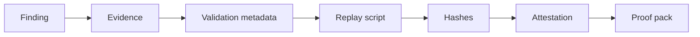

# Vantix Proof Packs

Proof packs make Vantix findings portable, replayable, and tamper-evident.



## Layout

```text
proof-pack/
  finding.json
  finding.md
  evidence/
  validation/
    replay.json
    replay.sh
    expected_output.txt
    verifier_result.json
  hashes.json
  attestation.json
  attestation.sig
```

## Verify

```bash
python scripts/vantix proof verify /path/to/proof-pack
```

Exit codes:

| Code | Meaning |
|---:|---|
| `0` | Confirmed. |
| `1` | Failed, tampered, or missing required proof material. |
| `2` | Environment mismatch or incomplete replay context. |

## Replay

```bash
python scripts/vantix replay /path/to/proof-pack
```

## Product rule

A proof pack is not a marketing artifact. It should contain enough structured evidence for a reviewer to understand what was proven, what was not proven, and which artifacts were hashed, redacted, or excluded.
