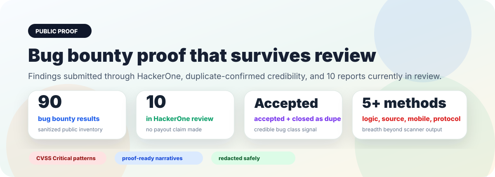
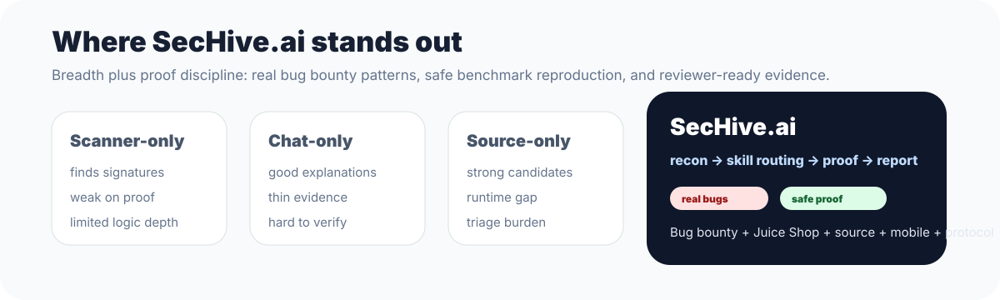

# Bug Bounty Proof Pack

  

  <kbd>90 sanitized bug bounty results</kbd>
  <kbd>10 HackerOne reports in review</kbd>
  <kbd>accepted / duplicate-confirmed signal</kbd>
  <kbd>no payout claim</kbd>

> **Proof, not scanner noise.**
> This corpus shows report-shaped vulnerability work: root cause, affected
> component class, exploit narrative, observed result, impact, and remediation.
> Public docs preserve the mechanism while removing live target details.

## Why This Is A Stronger Example

Most public AI-security demos stop at one of three points: a benchmark scan, a
chat transcript, or a source-only suspicion. This proof pack is different. It
shows breadth across bug bounty, source review, protocol logic, identity, mobile,
and reproducible benchmarks, with findings shaped for human triage.

| Signal | What it proves |
| --- | --- |
| **HackerOne submissions** | SecHive-style work has produced credible reports submitted through HackerOne, including accepted/closed-as-duplicate outcomes and 10 currently in review. |
| **90-result inventory** | The system is not tuned to one toy class; it spans identity, mobile, source, protocol, value-transfer, cloud, and governance surfaces. |
| **CVSS-rich patterning** | Findings preserve severity, business impact, proof style, and remediation without leaking private targets. |
| **Benchmark counterpart** | Juice Shop reports publish full routes, payloads, and evidence where disclosure is safe. |

## Top Value Findings By Method

| Method | Standout proof | Severity signal | Why it matters |
| --- | --- | --- | --- |
| **Business logic / runtime validation** | Runtime authorization replay | <kbd>CVSS High/Critical pattern</kbd> | One signed action can execute repeatedly when nonce-like authorization material is not consumed. |
| **Source-first policy review** | Destination denylist bypass | <kbd>Critical impact class</kbd> | Policy is enforced on one boundary but skipped where value is actually released. |
| **Cross-domain reasoning** | Asset/domain rebind through forwarding data | <kbd>Critical impact class</kbd> | Valid authority for one asset or domain can be rebound to another through trusted inner data. |
| **Auth and identity review** | Sensitive account change without step-up | <kbd>Account-control class</kbd> | Sensitive account mutation proceeds without the expected fresh-auth boundary. |
| **Mobile / exported interface review** | Exported account, wallet, and binder surfaces | <kbd>Mobile trust-boundary class</kbd> | Android-style exported components expose data or action paths that should stay internal. |

## Competitive Standout

  

> **Breadth is the point.**
> SecHive is not presenting one cherry-picked exploit. The proof set covers
> runtime web behavior, source review, mobile/exported interfaces, consensus
> and protocol logic, identity flows, value-transfer systems, and benchmark
> reproduction.

## Featured Pattern: Runtime Authorization Replay

Read the full public-safe write-up:
[Runtime Authorization Replay](runtime-authorization-replay.md).

<kbd>Authorization invariant</kbd> <kbd>Replay validation</kbd>
<kbd>Reviewer-friendly proof</kbd>

The core bug class is simple and dangerous: a signed action looks single-use
because it contains a nonce, but the system never records that nonce as used.
The review-ready proof is crisp:

1. One valid authorization exists.
2. The first execution succeeds.
3. The same authorization is replayed without mutation.
4. The second execution succeeds.

That is a broken invariant, not a vague risk.

## Featured Pattern: Validation Boundary / Denylist Bypass

Read the full public-safe write-up:
[Validation Boundary / Denylist Bypass](validation-boundary-bypass.md).

<kbd>Policy boundary</kbd> <kbd>Denylist bypass</kbd>
<kbd>Destination-side check</kbd>

This family covers findings where policy is checked in one place but the actual
value-changing operation happens somewhere else. The strongest proofs show the
direct policy boundary rejecting the object, then an alternate execution path
accepting it anyway.

## Featured Pattern: Cross-Domain / Cross-Asset Logic Abuse

Read the full public-safe write-up:
[Cross-Domain / Cross-Asset Logic Abuse](cross-domain-logic-abuse.md).

<kbd>Object binding</kbd> <kbd>Asset-domain mismatch</kbd>
<kbd>Cross-boundary reasoning</kbd>

This is the highest-signal style of finding because it requires reasoning across
layers: outer authorization, hook data, forwarding calldata, domain
registration, asset custody, and final state mutation.

## What The Public Docs Do Not Claim

> **No payout claim. No target disclosure. No live exploit recipe.**
> The HackerOne outcome claim is limited to credibility: reports were submitted
> through HackerOne, some were accepted and closed as duplicates, and 10 are
> currently in review. Public docs do not name programs, report IDs, private
> repositories, targets, accounts, addresses, or reusable production payloads.

## Full Result List

- [Redacted Bug Bounty Pattern Inventory](redacted-bug-bounty-patterns.md)
- [Public case study overview](sechive_public_case_study_v5.md)
- [OWASP Juice Shop proof pack](juice-shop-proof.md)
