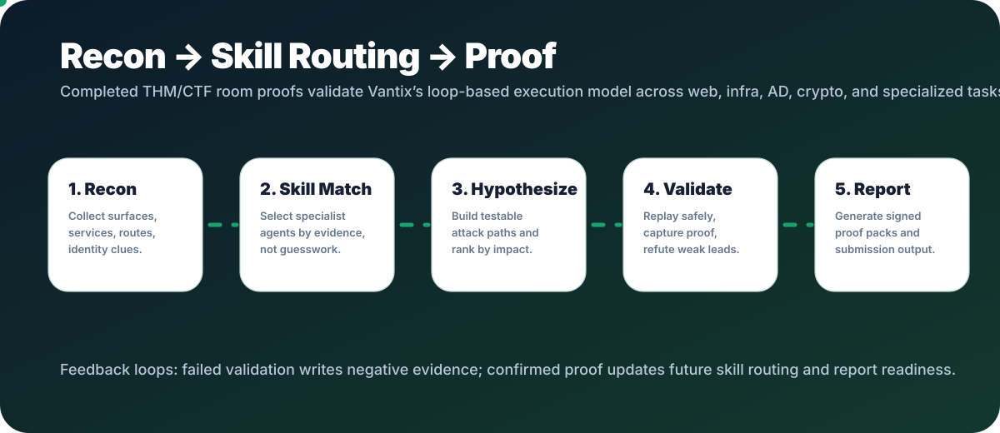

# Completed THM / CTF Proof Inventory

  

  <kbd>completed THM CTF rooms</kbd>
  <kbd>evidence-backed only</kbd>
  <kbd>difficulty listed</kbd>
  <kbd>completed only</kbd>

This page is the completed-room proof appendix for Vantix. It lists only rooms
with local completion evidence: solved notes, captured proof, completed session
summaries, or replay write-ups.

The point is simple: these rooms demonstrate the same loop Vantix productizes:
recon, skill selection, hypothesis building, validation, proof capture, and
report-ready explanation.

## Completed Room List

| Room | THM difficulty | Type | Proof status | Vantix capability demonstrated |
| --- | --- | --- | --- | --- |
| [Dave's Blog](https://tryhackme.com/room/davesblog) | Hard | CTF | Completed notes and write-up | NoSQL auth bypass, command execution, binary exploitation, root proof. |
| [Boiler CTF](https://tryhackme.com/room/boilerctf2) | Medium | CTF | Completed notes and write-up | FTP enumeration, CMS discovery, RCE validation, SUID privilege escalation. |
| [Sea Surfer](https://tryhackme.com/room/seasurfer) | Hard | CTF | Root proof captured | SSRF validation, LFI-to-RCE reasoning, unstable-target proof capture. |
| [StuxCTF](https://tryhackme.com/room/stuxctf) | Medium | CTF | User and root proof captured | Diffie-Hellman pathing, source decoding, PHP object injection, sudo proof. |
| [Attacktive Directory](https://tryhackme.com/room/attacktivedirectory) | Medium | CTF | Completed session path | AD enumeration, Kerberos user discovery, AS-REP roast, SMB share triage, domain proof. |
| [Gallery](https://tryhackme.com/room/gallery666) | Easy | CTF | Completed session summary | SQLi login, admin hash recovery, upload RCE, local privilege escalation. |
| [Red](https://tryhackme.com/room/redisl33t) | Easy | CTF | Three flags captured | LFI, credential mutation, callback capture, PwnKit-style root validation. |
| [TakeOver](https://tryhackme.com/room/takeover) | Easy | CTF | Completed retrospective | Subdomain/vhost enumeration, certificate SAN analysis, low-noise flag recovery. |
| [U.A. High School](https://tryhackme.com/room/yueiua) | Easy | CTF | Completed session summary | Web RCE, corrupted image repair, stego, credential recovery, sudo abuse. |

## Why This Belongs In Vantix

These completed rooms are useful because they cut across the product surfaces
Vantix has to handle in real work:

| Capability | Rooms that exercise it |
| --- | --- |
| Web exploitation and hidden route discovery | Dave's Blog, Boiler CTF, Sea Surfer, StuxCTF, Gallery, Red, TakeOver, U.A. High School |
| Privilege escalation and proof validation | Dave's Blog, Boiler CTF, Sea Surfer, StuxCTF, Gallery, Red, U.A. High School |
| Active Directory and credential-path reasoning | Attacktive Directory |
| Crypto, decoding, and reverse-engineering-adjacent work | StuxCTF, Red, U.A. High School |
| Scope-safe evidence discipline | All completed rooms listed above |

## Public-Safe Claim

Vantix has evidence-backed completed THM/CTF room proofs across easy, medium,
and hard public adversarial labs. The list above is intentionally narrow:
completed rooms only, no mobile THM claim, and no customer-production claim.
