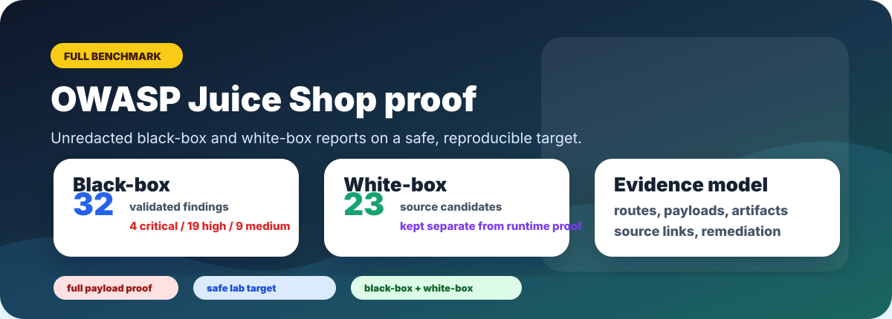

# OWASP Juice Shop Proof Pack

  

  <kbd>full unredacted benchmark</kbd>
  <kbd>111 current Juice Shop challenges</kbd>
  <kbd>35 live runtime findings</kbd>
  <kbd>58 source-aware items</kbd>

The Juice Shop reports are the reproducible public benchmark counterpart to the
redacted bug bounty corpus. Bug bounty results prove real-world depth; Juice Shop
proves that the same Vantix reporting style can be inspected end to end on a
safe, intentionally vulnerable target.

Unlike the bug bounty corpus, these reports are intentionally published in full.
Routes, payloads, source references, and evidence snippets are kept because the
target is OWASP Juice Shop, not a non-disclosable live program.

## Challenge Coverage Snapshot

The current OWASP Juice Shop source tree defines **111 challenges** in
`data/static/challenges.yml`. Vantix findings are not the same thing as Juice
Shop scoreboard unlocks, so the comparison below is reported as
challenge-equivalent coverage: one validated finding or source candidate counts
as one covered challenge-equivalent item only for sizing the remaining gap.

| Run style | Covered items | Missed challenge-equivalent gaps | Notes |
| --- | ---: | ---: | --- |
| Latest live runtime validation | 39 / 111 | 72 | Runtime findings are backed by live target behavior and evidence artifacts. |
| Latest source-aware validation | 64 / 111 | 47 | 39 runtime findings plus 23 source-analysis candidates and 2 source-review candidates; candidates remain separate from proof. |

## Published Reports

| Report | Scope | Result |
| --- | --- | --- |
| [Black-box reference report](../examples/juice-shop-blackbox-report.md) | Runtime testing without source | Archived report: 32 validated findings, 20 CVE references, 4 critical, 19 high, 9 medium. Latest validation: 35 runtime findings. |
| [White-box reference report](../examples/juice-shop-whitebox-report.md) | Runtime testing plus uploaded source | Archived report: 32 validated runtime findings plus 23 source-backed candidates. Latest validation: 58 source-aware finding/candidate items. |

> **Why this can be full-fidelity.**
> The bug bounty corpus is redacted because it comes from live programs. Juice
> Shop is an intentionally vulnerable benchmark, so routes, payloads, source
> references, evidence snippets, and remediation notes remain intact.

## Why These Reports Matter

The reports are intentionally complete. They show the output style reviewers
should expect from Vantix:

- scope and run context
- attack surface inventory
- severity summary
- validated runtime findings
- evidence snippets and artifact references
- remediation guidance
- source-backed candidates separated from runtime-validated findings

That split is important. Vantix should not treat source suspicion as runtime
proof. The white-box report keeps candidates distinct until validation confirms
exploitability.

## Top Black-Box Findings

<kbd>runtime proof</kbd> <kbd>observable behavior</kbd>
<kbd>no source required</kbd>

| Finding | Proof value |
| --- | --- |
| SQL injection authentication bypass | Demonstrates direct authentication impact with observable success markers. |
| Admin role injection during registration | Shows privilege assignment accepted from client-controlled input. |
| SQL injection data extraction signal | Extends injection beyond login into data access behavior. |
| IDOR on user, feedback, and basket resources | Shows object authorization gaps across multiple resource classes. |
| XXE file disclosure signal | Demonstrates parser-level file disclosure behavior. |
| SSRF internal fetch signal | Shows server-side request behavior controlled by user input. |
| Session token replay after logout | Tests session invalidation and replay resistance. |

Full report:
[OWASP Juice Shop Black-Box Reference Report](../examples/juice-shop-blackbox-report.md).

## Top White-Box Findings

<kbd>source-assisted</kbd> <kbd>candidate separation</kbd>
<kbd>runtime validation still required</kbd>

| Finding | Proof value |
| --- | --- |
| Server-side JavaScript `eval` paths | Highlights code execution risk and the exact files requiring review. |
| Sequelize raw SQL interpolation | Connects source evidence to black-box SQL injection behavior. |
| XML external entity expansion | Connects parser configuration to file disclosure risk. |
| Unsafe YAML loading | Identifies deserialization/resource-exhaustion paths before runtime proof. |
| Angular trusted HTML bypass and DOM sinks | Preserves frontend XSS candidates without overstating runtime validation. |
| Node SSRF URL fetch/request | Connects source-level request construction to runtime SSRF testing. |

Full report:
[OWASP Juice Shop White-Box Reference Report](../examples/juice-shop-whitebox-report.md).

## How This Complements Bug Bounty Proof

| Evidence type | Role |
| --- | --- |
| Redacted bug bounty corpus | Shows high-value real-world patterns while protecting disclosure boundaries. |
| Juice Shop black-box report | Shows complete dynamic testing and validated findings on a safe target. |
| Juice Shop white-box report | Shows source review, candidate separation, and validation discipline. |

Together, these are the public proof story: Vantix finds real bugs, explains why
they matter, separates candidates from proof, and can publish reproducible
reports without exposing private targets.
