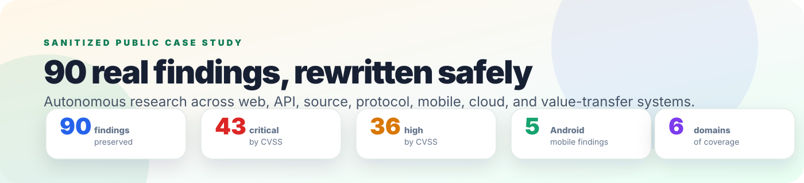
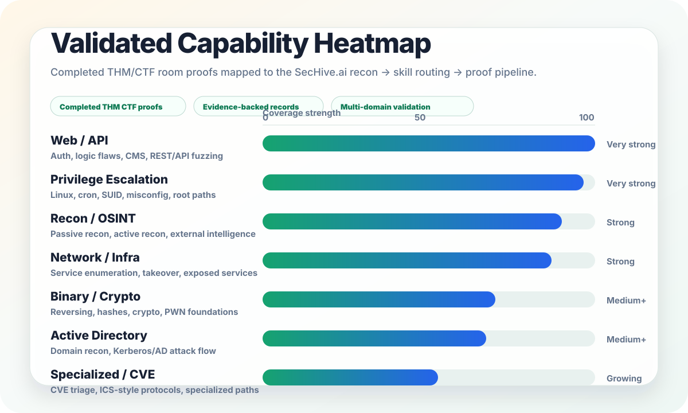
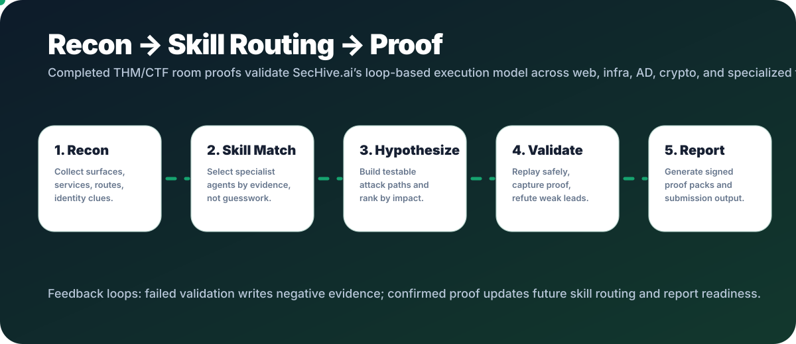
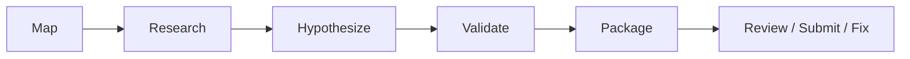

# SecHive Public Case Study V5

  

  <strong>Autonomous research that finds, chains, proves, and reports real bugs — without exposing targets, secrets, report links, or reusable exploit steps.</strong>

> **Public-safe sanitization.** This case study preserves mechanisms, severity signals, validation style, and business impact while removing target names, exact domains, report IDs, package names, secrets, hashes, package identifiers, and step-by-step exploit instructions.

---

## Executive summary

This case study shows the kind of work SecHive is designed to support: multi-surface bug hunting across source, protocols, identity, mobile apps, cloud/network configuration, and value-transfer systems.

The inventory below preserves **90 real findings** in a public-safe form. The original target details are intentionally removed. What remains is the security mechanism: trust boundary, validation style, severity signal, and business impact.

| Preserved findings | Critical by CVSS | High by CVSS | Android/mobile findings | Coverage domains |
|---:|---:|---:|---:|---:|
| **90** | **43** | **36** | **5** | **6** |

---

## Public Proof Baseline

The sanitized bug bounty inventory is strengthened by a separate completed
THM/CTF room baseline across web/API, infrastructure, privilege escalation,
Active Directory, crypto, reverse-engineering-adjacent work, CVE exploitation,
and specialized systems.

These completed rooms are not presented as customer production systems, and this
case study does not claim every room was fully automated. They are a public-safe
capability baseline showing that SecHive's workflow has been exercised across the
same vulnerability families it now routes, validates, and reports.

  

### Why this belongs in the case study

The bug bounty case study shows SecHive producing report-quality vulnerability
research across web/API, protocol, consensus, mobile, cloud, configuration, and
access-control classes. The CTF proof baseline shows broader operational
coverage: recon, exploitation, privilege escalation, Active Directory, crypto,
reversing, incident analysis, and specialized protocols.

| Proof source | What it demonstrates |
|---|---|
| **Sanitized bug bounty findings** | Real report-quality vulnerability research with CVSS, impact, proof style, and business relevance. |
| **Completed THM/CTF room proofs** | Breadth across repeatable security workflows and validated capability coverage. |
| **SecHive proof engine** | Evidence capture, validation, negative evidence, replay, proof packs, and mode-specific reporting. |

  

### Capability-to-engine mapping

| CTF capability | SecHive engine component | Case-study relevance |
|---|---|---|
| Recon and OSINT | Recon agent, target profile, surface mapper | Explains how SecHive finds weak signals before exploitation. |
| Web/API exploitation | Web/API skill packs, authz and business-logic agents | Maps to web/API and identity findings in the public inventory. |
| Privilege escalation | Exploit validation, proof-pack agent, post-exploit reasoning | Demonstrates full-chain validation discipline. |
| Active Directory | AD specialist agent and lateral-movement reasoning | Expands enterprise assessment credibility. |
| Binary/crypto/reversing | Reverse-engineering and crypto agents | Supports Android/APK and protocol/source review positioning. |
| Forensics/PCAP | Evidence and replay agents | Supports proof-first reporting and timeline reconstruction. |
| ICS/CVE scenarios | Specialized skill routing and CVE research agent | Shows SecHive can route beyond generic web scanning. |

The full linked inventory lists only completed THM/CTF room proofs with room
name, difficulty, proof status, and the SecHive capability each room exercises:
[Completed THM / CTF Proof Inventory](ctf-thm-proof-inventory.md).

> SecHive's public validation baseline supports the proof-first claim: recon
> evidence routes to the right specialist skill, hypotheses are validated or
> refuted, and confirmed findings are packaged into reproducible reports.

---

## What this proves

SecHive is not a passive scanner. It can reason across:

- web and API identity flows
- state machines and protocol invariants
- source-backed authorization logic
- Android manifests, exported components, and local callbacks
- cloud/network configuration secrets
- blockchain/value-transfer invariants
- replayable proof narratives and report-ready evidence

The important point is not that a tool listed findings. The important point is that SecHive can preserve mechanism, validation method, impact, and remediation direction while removing unsafe target-specific details.

---

## How SecHive thinks like a researcher

| Stage | What SecHive does |
|---|---|
| **Map** | Enumerates contracts, routes, RPCs, Android components, identity flows, packages, and configuration surfaces. |
| **Research** | Reads source, decompiles APKs when allowed, inspects state machines, and compares implementation behavior against invariants. |
| **Hypothesize** | Looks for policy mismatches, stale authority, callback trust, unsafe assumptions, and missing destination-side checks. |
| **Validate** | Builds bounded replay or proof paths, captures safe evidence, writes negative evidence when proof fails, and avoids destructive behavior. |
| **Package** | Ranks, explains impact, redacts sensitive details, and renders a report-ready narrative. |

---

## Example attack chains

### Cross-chain policy bypass

**Initial signal:** a receive path enforced policy on outbound burns but not destination mint recipients.

**Hypothesis:** a blocked account could still receive value from a previously valid remote burn.

**Validation style:** SecHive traced the burn → attestation → receive lifecycle and modeled the missing destination-side check.

**Result:** value-transfer controls could be bypassed without key compromise or signature forgery.

### Consensus trust boundary

**Initial signal:** proposal reconstruction accepted data from streamed parts rather than authenticated proposal messages.

**Hypothesis:** a peer-controlled field could influence proposer identity or validity classification.

**Validation style:** SecHive modeled the state-machine path and identified where application validation or cryptographic binding was missing.

**Result:** consensus safety or liveness assumptions could be weakened through malformed but structurally accepted inputs.

### Android component abuse

**Initial signal:** exported Android components and local callbacks interacted with account or wallet state.

**Hypothesis:** a malicious local app could inject or read trusted state through an exposed component.

**Validation style:** SecHive connected manifest exposure to reachable app behavior and described a bounded proof concept.

**Result:** sensitive account, wallet, or identity workflows could be abused without relying on remote exploitation.

---

## Capability coverage

| Domain | Findings | What SecHive demonstrated |
|---|---:|---|
| Web / API / identity | 28 | Login flows, callbacks, tokens, session state, postMessage, CMS, account recovery, and access control. |
| Consensus / validator security | 28 | Validator sets, proposal handling, finality, certificates, sync behavior, liveness, and state-machine safety. |
| Blockchain / value-transfer protocol | 21 | Mint/burn, settlement, cross-chain messaging, denylist enforcement, role drift, and value-flow invariants. |
| Android / mobile app security | 5 | APK review, exported components, IPC, local callbacks, account/wallet flows, and diagnostic exposure. |
| Cloud / network configuration | 5 | Secrets, VPN/BGP/WiFi credentials, role-scoped exposure, and device configuration. |
| Application logic / access control | 3 | Workflow authorization and state-boundary violations. |

---

## Evidence without exposure

| Visible in this public version | Removed from this public version |
|---|---|
| Root-cause mechanism | Target/program names |
| Validation style | Exact domains/routes/packages |
| CVSS vector | Secrets, hashes, tokens, private data |
| Business impact | Report IDs and private report links |
| Capability demonstrated | Step-by-step exploit instructions |
| Sanitized titles and domains | Customer/vendor identifying details |

---

## Highest-ranked sanitized findings

| Rank | Sanitized finding | Domain | Severity |
|---:|---|---|---|
| 1 | PartsOnly Proposal Reconstruction Allows Forged Proposer Authority | Web / API / identity | Critical · 10.0 |
| 2 | Peer-Supplied Proposal Parts Allow Proposer Identity Impersonation | Consensus / validator security | Critical · 10.0 |
| 3 | Duplicate Remote Execution Can Submit Multiple EVM Writes | Application logic / access control | Critical · 10.0 |
| 4 | Stale Multisig Approval Persists After Role Revocation | Blockchain / value-transfer protocol | Critical · 10.0 |
| 5 | Valid Same-Round Equivocations Force Unbounded WAL and Evidence Growth | Consensus / validator security | Critical · 10.0 |
| 6 | Corrupted Sync Value With Valid Certificate Can Stall Synchronization | Consensus / validator security | Critical · 10.0 |
| 7 | Sync Finalization Accepts Empty Vote Extensions | Consensus / validator security | Critical · 10.0 |
| 8 | Unauthenticated Keyshare Repair RPC Exposes Private Signing Material | Web / API / identity | Critical · 9.6 |
| 9 | Forged Uninstall Manifest Can Remove Another Wallet Module's Hooks | Consensus / validator security | Critical · 9.6 |
| 10 | Cross-Chain Message Execution Ignores Minimum Finality Requirements | Consensus / validator security | Critical · 9.6 |

---

## Commercial takeaway

The value shown here is breadth plus proof discipline. SecHive can move between web/API, source, Android, protocol, cloud, and value-transfer surfaces while keeping the result reviewable.

That is the difference between activity and outcome:

- activity: "the agent tried things"
- outcome: "the finding has mechanism, proof style, severity, impact, and export-safe evidence"

---

## Full sanitized inventory

Public-safe by design: this table keeps all 90 findings, with cleaned titles, corrected domains, full CVSS vectors, fixed severity labels, and finding-specific impact statements.

| # | Finding | Domain | Severity | CVSS vector | Scoring source | What it could accomplish |
|---:|---|---|---|---|---|---|
| 1 | PartsOnly Proposal Reconstruction Allows Forged Proposer Authority | Web / API / identity | Critical · 10.0 | CVSS:3.1/AV:N/AC:L/PR:N/UI:N/S:C/C:N/I:H/A:H | Analyst-derived from sanitized context | Attackers could obtain login artifacts, session material, sensitive data, or account-control primitives, leading to account takeover or workflow abuse. |
| 2 | Peer-Supplied Proposal Parts Allow Proposer Identity Impersonation | Consensus / validator security | Critical · 10.0 | CVSS:3.1/AV:N/AC:L/PR:N/UI:N/S:C/C:N/I:H/A:H | Analyst-derived from sanitized context | Consensus participants could accept invalid state, forged authority, unsafe finality, or divergent block validity, weakening network safety and trust assumptions. |
| 3 | Duplicate Remote Execution Can Submit Multiple EVM Writes | Application logic / access control | Critical · 10.0 | CVSS:3.1/AV:N/AC:L/PR:N/UI:N/S:C/C:N/I:H/A:H | Analyst-derived from sanitized context | The flaw breaks an authorization or trust boundary and could become high-impact when chained with normal user roles, state changes, or integration behavior. |
| 4 | Stale Multisig Approval Persists After Role Revocation | Blockchain / value-transfer protocol | Critical · 10.0 | CVSS:3.1/AV:N/AC:L/PR:N/UI:N/S:C/C:N/I:H/A:H | Analyst-derived from sanitized context | Funds may be minted, redirected, blocked, duplicated, or rendered unrecoverable, breaking value-transfer guarantees. |
| 5 | Valid Same-Round Equivocations Force Unbounded WAL and Evidence Growth | Consensus / validator security | Critical · 10.0 | CVSS:3.1/AV:N/AC:L/PR:N/UI:N/S:C/C:N/I:H/A:H | Analyst-derived from sanitized context | A peer or validator-triggered condition could degrade liveness, exhaust resources, or halt consensus progress, creating network availability risk. |
| 6 | Corrupted Sync Value With Valid Certificate Can Stall Synchronization | Consensus / validator security | Critical · 10.0 | CVSS:3.1/AV:N/AC:L/PR:N/UI:N/S:C/C:N/I:H/A:H | Analyst-derived from sanitized context | A peer or validator-triggered condition could degrade liveness, exhaust resources, or halt consensus progress, creating network availability risk. |
| 7 | Sync Finalization Accepts Empty Vote Extensions | Consensus / validator security | Critical · 10.0 | CVSS:3.1/AV:N/AC:L/PR:N/UI:N/S:C/C:N/I:H/A:H | Analyst-derived from sanitized context | Consensus participants could accept invalid state, forged authority, unsafe finality, or divergent block validity, weakening network safety and trust assumptions. |
| 8 | Unauthenticated Keyshare Repair RPC Exposes Private Signing Material | Web / API / identity | Critical · 9.6 | CVSS:3.1/AV:N/AC:L/PR:L/UI:N/S:C/C:N/I:H/A:H | Analyst-derived from sanitized context | Attackers could obtain login artifacts, session material, sensitive data, or account-control primitives, leading to account takeover or workflow abuse. |
| 9 | Forged Uninstall Manifest Can Remove Another Wallet Module's Hooks | Consensus / validator security | Critical · 9.6 | CVSS:3.1/AV:N/AC:L/PR:L/UI:N/S:C/C:N/I:H/A:H | Analyst-derived from sanitized context | A peer or validator-triggered condition could degrade liveness, exhaust resources, or halt consensus progress, creating network availability risk. |
| 10 | Cross-Chain Message Execution Ignores Minimum Finality Requirements | Consensus / validator security | Critical · 9.6 | CVSS:3.1/AV:N/AC:L/PR:L/UI:N/S:C/C:N/I:H/A:H | Analyst-derived from sanitized context | Consensus participants could accept invalid state, forged authority, unsafe finality, or divergent block validity, weakening network safety and trust assumptions. |
| 11 | Inbound Mint Path Bypasses Recipient Denylist Enforcement | Blockchain / value-transfer protocol | Critical · 9.6 | CVSS:3.1/AV:N/AC:L/PR:L/UI:N/S:C/C:N/I:H/A:H | Analyst-derived from sanitized context | Risk-controlled or blocked accounts could continue moving value through alternate paths, defeating compliance, emergency controls, or sanctions-style restrictions. |
| 12 | PartsOnly Mode Synthesizes Proposer Input Without Authenticated Proposal | Web / API / identity | Critical · 9.6 | CVSS:3.1/AV:N/AC:L/PR:L/UI:N/S:C/C:N/I:H/A:H | Analyst-derived from sanitized context | Attackers could obtain login artifacts, session material, sensitive data, or account-control primitives, leading to account takeover or workflow abuse. |
| 13 | Incomplete Proposal Commitments Marked Valid During Consensus | Consensus / validator security | Critical · 9.6 | CVSS:3.1/AV:N/AC:L/PR:L/UI:N/S:C/C:N/I:H/A:H | Analyst-derived from sanitized context | Consensus participants could accept invalid state, forged authority, unsafe finality, or divergent block validity, weakening network safety and trust assumptions. |
| 14 | Post-Burn Replacement Can Redirect Attested Transfers After Policy Changes | Blockchain / value-transfer protocol | Critical · 9.6 | CVSS:3.1/AV:N/AC:L/PR:L/UI:N/S:C/C:N/I:H/A:H | Analyst-derived from sanitized context | Funds may be minted, redirected, blocked, duplicated, or rendered unrecoverable, breaking value-transfer guarantees. |
| 15 | Removing a Mint Controller Does Not Revoke Existing Mint Authority | Web / API / identity | Critical · 9.6 | CVSS:3.1/AV:N/AC:L/PR:L/UI:N/S:C/C:N/I:H/A:H | Analyst-derived from sanitized context | Attackers could obtain login artifacts, session material, sensitive data, or account-control primitives, leading to account takeover or workflow abuse. |
| 16 | Blocklisted Issuance Authority Can Still Create Active Mint Paths | Web / API / identity | Critical · 9.6 | CVSS:3.1/AV:N/AC:L/PR:L/UI:N/S:C/C:N/I:H/A:H | Analyst-derived from sanitized context | Attackers could obtain login artifacts, session material, sensitive data, or account-control primitives, leading to account takeover or workflow abuse. |
| 17 | Reserved Nonce Use Makes Outbound Burns Unredeemable | Blockchain / value-transfer protocol | Critical · 9.6 | CVSS:3.1/AV:N/AC:L/PR:L/UI:N/S:C/C:N/I:H/A:H | Analyst-derived from sanitized context | Users or integrations could complete apparently valid burns or transfers that cannot be redeemed, permanently stranding value. |
| 18 | Cross-chain protocol V2 inbound receive ignores TokenMessengerMinter denylist for mint recipients | Blockchain / value-transfer protocol | Critical · 9.6 | CVSS:3.1/AV:N/AC:L/PR:L/UI:N/S:C/C:N/I:H/A:H | Analyst-derived from sanitized context | Risk-controlled or blocked accounts could continue moving value through alternate paths, defeating compliance, emergency controls, or sanctions-style restrictions. |
| 19 | Arbitrary Forwarded Selectors Allow Replacement of Prior Bridge Burns | Blockchain / value-transfer protocol | Critical · 9.6 | CVSS:3.1/AV:N/AC:L/PR:L/UI:N/S:C/C:N/I:H/A:H | Analyst-derived from sanitized context | Funds may be minted, redirected, blocked, duplicated, or rendered unrecoverable, breaking value-transfer guarantees. |
| 20 | Oversized Burn Amount Blackholes Destination Mint | Blockchain / value-transfer protocol | Critical · 9.6 | CVSS:3.1/AV:N/AC:L/PR:L/UI:N/S:C/C:N/I:H/A:H | Analyst-derived from sanitized context | Users or integrations could complete apparently valid burns or transfers that cannot be redeemed, permanently stranding value. |
| 21 | Validator Registration Order Allows Preassigned Slot Hijacking | Consensus / validator security | Critical · 9.6 | CVSS:3.1/AV:N/AC:L/PR:L/UI:N/S:C/C:N/I:H/A:H | Analyst-derived from sanitized context | Consensus participants could accept invalid state, forged authority, unsafe finality, or divergent block validity, weakening network safety and trust assumptions. |
| 22 | Valid Attested Burns Above Destination Limit Become Unmintable | Blockchain / value-transfer protocol | Critical · 9.6 | CVSS:3.1/AV:N/AC:L/PR:L/UI:N/S:C/C:N/I:H/A:H | Analyst-derived from sanitized context | Users or integrations could complete apparently valid burns or transfers that cannot be redeemed, permanently stranding value. |
| 23 | Invalid Recipient Encoding Blackholes Cross-Chain Burns | Blockchain / value-transfer protocol | Critical · 9.6 | CVSS:3.1/AV:N/AC:L/PR:L/UI:N/S:C/C:N/I:H/A:H | Analyst-derived from sanitized context | Users or integrations could complete apparently valid burns or transfers that cannot be redeemed, permanently stranding value. |
| 24 | Global Payment Nonce Allows One Payer to Block Another Payer's Settlement | Blockchain / value-transfer protocol | Critical · 9.6 | CVSS:3.1/AV:N/AC:L/PR:L/UI:N/S:C/C:N/I:H/A:H | Analyst-derived from sanitized context | Funds may be minted, redirected, blocked, duplicated, or rendered unrecoverable, breaking value-transfer guarantees. |
| 25 | Gateway Batch Processing Can Create Unbacked Credit | Blockchain / value-transfer protocol | Critical · 9.6 | CVSS:3.1/AV:N/AC:L/PR:L/UI:N/S:C/C:N/I:H/A:H | Analyst-derived from sanitized context | Unauthorized or stale authority could create, redirect, or release value outside intended controls, creating direct financial exposure. |
| 26 | Leading Authorized Execution Skips Later Receiver Blacklist Checks | Web / API / identity | Critical · 9.6 | CVSS:3.1/AV:N/AC:L/PR:L/UI:N/S:C/C:N/I:H/A:H | Analyst-derived from sanitized context | Attackers could obtain login artifacts, session material, sensitive data, or account-control primitives, leading to account takeover or workflow abuse. |
| 27 | High-throughput chain cross-chain protocol v2 inbound receive releases funds to a denylisted recipient owner | Blockchain / value-transfer protocol | Critical · 9.6 | CVSS:3.1/AV:N/AC:L/PR:L/UI:N/S:C/C:N/I:H/A:H | Analyst-derived from sanitized context | Risk-controlled or blocked accounts could continue moving value through alternate paths, defeating compliance, emergency controls, or sanctions-style restrictions. |
| 28 | Gateway Denylist Does Not Freeze Existing Funds or Exit Paths | Blockchain / value-transfer protocol | Critical · 9.6 | CVSS:3.1/AV:N/AC:L/PR:L/UI:N/S:C/C:N/I:H/A:H | Analyst-derived from sanitized context | Risk-controlled or blocked accounts could continue moving value through alternate paths, defeating compliance, emergency controls, or sanctions-style restrictions. |
| 29 | Revoked Delegate Can Still Authorize Fresh Burns | Web / API / identity | Critical · 9.6 | CVSS:3.1/AV:N/AC:L/PR:L/UI:N/S:C/C:N/I:H/A:H | Analyst-derived from sanitized context | Attackers could obtain login artifacts, session material, sensitive data, or account-control primitives, leading to account takeover or workflow abuse. |
| 30 | Blocklisted Account Can Transfer Funds Through Indirect Object Ownership | Blockchain / value-transfer protocol | Critical · 9.6 | CVSS:3.1/AV:N/AC:L/PR:L/UI:N/S:C/C:N/I:H/A:H | Analyst-derived from sanitized context | Risk-controlled or blocked accounts could continue moving value through alternate paths, defeating compliance, emergency controls, or sanctions-style restrictions. |
| 31 | Blocklisted Administrator Can Self-Unfreeze Through Governance Path | Blockchain / value-transfer protocol | Critical · 9.6 | CVSS:3.1/AV:N/AC:L/PR:L/UI:N/S:C/C:N/I:H/A:H | Analyst-derived from sanitized context | Risk-controlled or blocked accounts could continue moving value through alternate paths, defeating compliance, emergency controls, or sanctions-style restrictions. |
| 32 | Blacklist Migration Silently Unfreezes Omitted Legacy Accounts | Blockchain / value-transfer protocol | Critical · 9.6 | CVSS:3.1/AV:N/AC:L/PR:L/UI:N/S:C/C:N/I:H/A:H | Analyst-derived from sanitized context | Risk-controlled or blocked accounts could continue moving value through alternate paths, defeating compliance, emergency controls, or sanctions-style restrictions. |
| 33 | Removing a Mint Controller Does Not Revoke Existing Mint Authority | Web / API / identity | Critical · 9.6 | CVSS:3.1/AV:N/AC:L/PR:L/UI:N/S:C/C:N/I:H/A:H | Analyst-derived from sanitized context | Attackers could obtain login artifacts, session material, sensitive data, or account-control primitives, leading to account takeover or workflow abuse. |
| 34 | Blocklisted Multisig Can Still Complete Governance Actions | Blockchain / value-transfer protocol | Critical · 9.6 | CVSS:3.1/AV:N/AC:L/PR:L/UI:N/S:C/C:N/I:H/A:H | Analyst-derived from sanitized context | Risk-controlled or blocked accounts could continue moving value through alternate paths, defeating compliance, emergency controls, or sanctions-style restrictions. |
| 35 | Stale Controller Approval Can Enable Minting After Revocation | Blockchain / value-transfer protocol | Critical · 9.6 | CVSS:3.1/AV:N/AC:L/PR:L/UI:N/S:C/C:N/I:H/A:H | Analyst-derived from sanitized context | Unauthorized or stale authority could create, redirect, or release value outside intended controls, creating direct financial exposure. |
| 36 | Fake Allow-Asset Path Enables Unbacked Swap Mint | Blockchain / value-transfer protocol | Critical · 9.6 | CVSS:3.1/AV:N/AC:L/PR:L/UI:N/S:C/C:N/I:H/A:H | Analyst-derived from sanitized context | Unauthorized or stale authority could create, redirect, or release value outside intended controls, creating direct financial exposure. |
| 37 | Attestations Below Requested Finality Are Accepted | Consensus / validator security | Critical · 9.6 | CVSS:3.1/AV:N/AC:L/PR:L/UI:N/S:C/C:N/I:H/A:H | Analyst-derived from sanitized context | Consensus participants could accept invalid state, forged authority, unsafe finality, or divergent block validity, weakening network safety and trust assumptions. |
| 38 | Future-Round Votes Allocate Unbounded Consensus State | Consensus / validator security | Critical · 9.6 | CVSS:3.1/AV:N/AC:L/PR:L/UI:N/S:C/C:N/I:H/A:H | Analyst-derived from sanitized context | A peer or validator-triggered condition could degrade liveness, exhaust resources, or halt consensus progress, creating network availability risk. |
| 39 | Attestations Below Requested Finality Are Accepted | Consensus / validator security | Critical · 9.6 | CVSS:3.1/AV:N/AC:L/PR:L/UI:N/S:C/C:N/I:H/A:H | Analyst-derived from sanitized context | Consensus participants could accept invalid state, forged authority, unsafe finality, or divergent block validity, weakening network safety and trust assumptions. |
| 40 | Read-Only API Token Enumerates Token Inventory and Wallet Metadata | Web / API / identity | Critical · 9.3 | CVSS:3.1/AV:N/AC:L/PR:N/UI:R/S:C/C:H/I:H/A:N | Analyst-derived from sanitized context | Attackers could obtain login artifacts, session material, sensitive data, or account-control primitives, leading to account takeover or workflow abuse. |
| 41 | Authenticated Session Can Rebind Account Email Without Step-Up Verification | Web / API / identity | Critical · 9.3 | CVSS:3.1/AV:N/AC:L/PR:N/UI:R/S:C/C:H/I:H/A:N | Analyst-derived from sanitized context | Attackers could obtain login artifacts, session material, sensitive data, or account-control primitives, leading to account takeover or workflow abuse. |
| 42 | Member Pricing Can Be Obtained Without Authenticated Member Session | Web / API / identity | Critical · 9.3 | CVSS:3.1/AV:N/AC:L/PR:N/UI:R/S:C/C:H/I:H/A:N | Analyst-derived from sanitized context | Attackers could obtain login artifacts, session material, sensitive data, or account-control primitives, leading to account takeover or workflow abuse. |
| 43 | Strong-Auth Gate Can Be Deferred While Password and MFA Are Changed | Web / API / identity | Critical · 9.3 | CVSS:3.1/AV:N/AC:L/PR:N/UI:R/S:C/C:H/I:H/A:N | Analyst-derived from sanitized context | Attackers could obtain login artifacts, session material, sensitive data, or account-control primitives, leading to account takeover or workflow abuse. |
| 44 | Proposal Part Validation Fails to Preserve Consensus Round Integrity | Consensus / validator security | High · 8.5 | CVSS:3.1/AV:N/AC:L/PR:L/UI:N/S:C/C:N/I:L/A:H | Analyst-derived from sanitized context | Consensus participants could accept invalid state, forged authority, unsafe finality, or divergent block validity, weakening network safety and trust assumptions. |
| 45 | Exposed Internal Investigation RPC Allows Unauthorized State Mutation | Web / API / identity | High · 8.5 | CVSS:3.1/AV:N/AC:L/PR:L/UI:N/S:C/C:N/I:L/A:H | Analyst-derived from sanitized context | Attackers could obtain login artifacts, session material, sensitive data, or account-control primitives, leading to account takeover or workflow abuse. |
| 46 | Read-only UniFi Network users can trigger LCM wake/sync commands on site devices | Consensus / validator security | High · 8.5 | CVSS:3.1/AV:N/AC:L/PR:L/UI:N/S:C/C:N/I:L/A:H | Analyst-derived from sanitized context | Consensus participants could accept invalid state, forged authority, unsafe finality, or divergent block validity, weakening network safety and trust assumptions. |
| 47 | Malformed Validator Keys Can Panic Validator-Set Decoding | Consensus / validator security | High · 8.5 | CVSS:3.1/AV:N/AC:L/PR:L/UI:N/S:C/C:N/I:L/A:H | Analyst-derived from sanitized context | A peer or validator-triggered condition could degrade liveness, exhaust resources, or halt consensus progress, creating network availability risk. |
| 48 | Zero-Power Active Validator Set Causes Consensus Panic | Consensus / validator security | High · 8.5 | CVSS:3.1/AV:N/AC:L/PR:L/UI:N/S:C/C:N/I:L/A:H | Analyst-derived from sanitized context | A peer or validator-triggered condition could degrade liveness, exhaust resources, or halt consensus progress, creating network availability risk. |
| 49 | Pre-Verification Consensus Queue Allows Validator Memory Exhaustion | Consensus / validator security | High · 8.5 | CVSS:3.1/AV:N/AC:L/PR:L/UI:N/S:C/C:N/I:L/A:H | Analyst-derived from sanitized context | A peer or validator-triggered condition could degrade liveness, exhaust resources, or halt consensus progress, creating network availability risk. |
| 50 | Malformed Active Validator Set Panics Consensus Decoding | Consensus / validator security | High · 8.5 | CVSS:3.1/AV:N/AC:L/PR:L/UI:N/S:C/C:N/I:L/A:H | Analyst-derived from sanitized context | A peer or validator-triggered condition could degrade liveness, exhaust resources, or halt consensus progress, creating network availability risk. |
| 51 | Exported Account Activity Brokers Auth Tokens to Third-Party Apps | Android / mobile app security | High · 8.2 | CVSS:3.1/AV:L/AC:L/PR:N/UI:R/S:C/C:H/I:H/A:N | Analyst-derived from sanitized context | A malicious app could abuse exported components or local callbacks to inject trusted account state, capture tokens, or bypass sensitive user verification flows. |
| 52 | Frameable Login Flow Leaks Success Payload via Unrestricted postMessage | Web / API / identity | High · 8.2 | CVSS:3.1/AV:L/AC:L/PR:N/UI:R/S:C/C:H/I:H/A:N | Analyst-derived from sanitized context | Attackers could obtain login artifacts, session material, sensitive data, or account-control primitives, leading to account takeover or workflow abuse. |
| 53 | External Callback Parameter Exfiltrates Login Ticket or Authorization Code | Web / API / identity | High · 8.2 | CVSS:3.1/AV:L/AC:L/PR:N/UI:R/S:C/C:H/I:H/A:N | Analyst-derived from sanitized context | Attackers could obtain login artifacts, session material, sensitive data, or account-control primitives, leading to account takeover or workflow abuse. |
| 54 | Leaked Identity Authorization Code Chains Into Cloud Session Access | Web / API / identity | High · 8.2 | CVSS:3.1/AV:L/AC:L/PR:N/UI:R/S:C/C:H/I:H/A:N | Analyst-derived from sanitized context | Attackers could obtain login artifacts, session material, sensitive data, or account-control primitives, leading to account takeover or workflow abuse. |
| 55 | Cross-Origin Login-State Issuance Is Readable by Untrusted Origins | Web / API / identity | High · 8.2 | CVSS:3.1/AV:L/AC:L/PR:N/UI:R/S:C/C:H/I:H/A:N | Analyst-derived from sanitized context | Attackers could obtain login artifacts, session material, sensitive data, or account-control primitives, leading to account takeover or workflow abuse. |
| 56 | Public JavaScript Exposes Cloud Business Secrets and Auth Bootstrap Material | Web / API / identity | High · 8.2 | CVSS:3.1/AV:L/AC:L/PR:N/UI:R/S:C/C:H/I:H/A:N | Analyst-derived from sanitized context | Attackers could obtain login artifacts, session material, sensitive data, or account-control primitives, leading to account takeover or workflow abuse. |
| 57 | Attacker-Controlled Return Location Drives Final Post-Login Redirect | Web / API / identity | High · 8.2 | CVSS:3.1/AV:L/AC:L/PR:N/UI:R/S:C/C:H/I:H/A:N | Analyst-derived from sanitized context | Attackers could obtain login artifacts, session material, sensitive data, or account-control primitives, leading to account takeover or workflow abuse. |
| 58 | Exported Account-Login Receiver Allows Wallet Auth-Token Injection | Web / API / identity | High · 8.2 | CVSS:3.1/AV:L/AC:L/PR:N/UI:R/S:C/C:H/I:H/A:N | Report-provided CVSS vector | Attackers could obtain login artifacts, session material, sensitive data, or account-control primitives, leading to account takeover or workflow abuse. |
| 59 | Exported User Center Provider Exposes Account Data Access Path | Android / mobile app security | High · 8.2 | CVSS:3.1/AV:L/AC:L/PR:N/UI:R/S:C/C:H/I:H/A:N | Analyst-derived from sanitized context | A malicious app could abuse exported components or local callbacks to inject trusted account state, capture tokens, or bypass sensitive user verification flows. |
| 60 | Exported NFC/TSM Binder Services Expose Privileged Payment Interfaces | Android / mobile app security | High · 8.2 | CVSS:3.1/AV:L/AC:L/PR:N/UI:R/S:C/C:H/I:H/A:N | Analyst-derived from sanitized context | A malicious app could abuse exported components or local callbacks to inject trusted account state, capture tokens, or bypass sensitive user verification flows. |
| 61 | Self-Reported Discovery Addresses Enable Bootstrap Identity Hijack | Application logic / access control | High · 8.2 | CVSS:3.1/AV:N/AC:L/PR:N/UI:N/S:U/C:N/I:L/A:H | Report-provided CVSS vector | The flaw breaks an authorization or trust boundary and could become high-impact when chained with normal user roles, state changes, or integration behavior. |
| 62 | Withdrawal Forwarding Allows Token Rebinding Outside the Attested Transfer | Consensus / validator security | High · 7.7 | CVSS:3.1/AV:N/AC:L/PR:L/UI:N/S:C/C:N/I:H/A:N | Analyst-derived from sanitized context | Consensus participants could accept invalid state, forged authority, unsafe finality, or divergent block validity, weakening network safety and trust assumptions. |
| 63 | Unauthenticated Deposit Address Query Bypasses Wallet Privacy Controls | Web / API / identity | High · 7.7 | CVSS:3.1/AV:N/AC:L/PR:L/UI:N/S:C/C:N/I:H/A:N | Analyst-derived from sanitized context | Attackers could obtain login artifacts, session material, sensitive data, or account-control primitives, leading to account takeover or workflow abuse. |
| 64 | Cold-Storage Address Book Authorization Bypass | Web / API / identity | High · 7.7 | CVSS:3.1/AV:N/AC:L/PR:L/UI:N/S:C/C:N/I:H/A:N | Analyst-derived from sanitized context | Attackers could obtain login artifacts, session material, sensitive data, or account-control primitives, leading to account takeover or workflow abuse. |
| 65 | Authorized Sender Can Rekey Operator and Seize Forwarding Capability | Web / API / identity | High · 7.7 | CVSS:3.1/AV:N/AC:L/PR:L/UI:N/S:C/C:N/I:H/A:N | Analyst-derived from sanitized context | Attackers could obtain login artifacts, session material, sensitive data, or account-control primitives, leading to account takeover or workflow abuse. |
| 66 | Payment Cancellation Signatures Are Not Bound to Attester Identity | Blockchain / value-transfer protocol | High · 7.7 | CVSS:3.1/AV:N/AC:L/PR:L/UI:N/S:C/C:N/I:H/A:N | Analyst-derived from sanitized context | Funds may be minted, redirected, blocked, duplicated, or rendered unrecoverable, breaking value-transfer guarantees. |
| 67 | Gateway denylist does not block withdrawal or burn exit paths, allowing denylisted depositors to move deposited funds | Consensus / validator security | High · 7.7 | CVSS:3.1/AV:N/AC:L/PR:L/UI:N/S:C/C:N/I:H/A:N | Report-provided CVSS vector | Consensus participants could accept invalid state, forged authority, unsafe finality, or divergent block validity, weakening network safety and trust assumptions. |
| 68 | Low-Weight Signer Can Authorize Gas Policy Fields Alone | Web / API / identity | High · 7.7 | CVSS:3.1/AV:N/AC:L/PR:L/UI:N/S:C/C:N/I:H/A:N | Analyst-derived from sanitized context | Attackers could obtain login artifacts, session material, sensitive data, or account-control primitives, leading to account takeover or workflow abuse. |
| 69 | Non-Contiguous Sync Batches Suppress Missing-Height Refills | Consensus / validator security | High · 7.5 | CVSS:3.1/AV:N/AC:L/PR:N/UI:N/S:U/C:N/I:N/A:H | Report-provided CVSS vector | Consensus participants could accept invalid state, forged authority, unsafe finality, or divergent block validity, weakening network safety and trust assumptions. |
| 70 | Local Wall-Clock Validation Can Split Consensus Acceptance | Consensus / validator security | High · 7.1 | CVSS:3.1/AV:L/AC:L/PR:N/UI:R/S:C/C:L/I:H/A:N | Analyst-derived from sanitized context | Consensus participants could accept invalid state, forged authority, unsafe finality, or divergent block validity, weakening network safety and trust assumptions. |
| 71 | Canceled Request Can Still Trigger Paid Transaction Creation | Application logic / access control | High · 7.1 | CVSS:3.1/AV:L/AC:L/PR:N/UI:R/S:C/C:L/I:H/A:N | Analyst-derived from sanitized context | The flaw breaks an authorization or trust boundary and could become high-impact when chained with normal user roles, state changes, or integration behavior. |
| 72 | ProposalOnly Mode Accepts Peer Values Without Application Validation | Consensus / validator security | High · 7.1 | CVSS:3.1/AV:L/AC:L/PR:N/UI:R/S:C/C:L/I:H/A:N | Analyst-derived from sanitized context | Consensus participants could accept invalid state, forged authority, unsafe finality, or divergent block validity, weakening network safety and trust assumptions. |
| 73 | Untrusted Local Callback Bypasses Wallet Real-Name Verification | Android / mobile app security | High · 7.1 | CVSS:3.1/AV:L/AC:L/PR:N/UI:R/S:C/C:L/I:H/A:N | Report-provided CVSS vector | A malicious app could abuse exported components or local callbacks to inject trusted account state, capture tokens, or bypass sensitive user verification flows. |
| 74 | Read-Only Users Can Retrieve Device Auto-Link Credentials | Cloud / network configuration | High · 7.1 | CVSS:3.1/AV:N/AC:L/PR:L/UI:N/S:U/C:H/I:L/A:N | Report-provided CVSS vector | Exposed configuration secrets could enable lateral movement, private network access, service impersonation, or downstream infrastructure compromise. |
| 75 | Static Export Exposes Full CMS Management Dataset | Web / API / identity | High · 7.1 | CVSS:3.1/AV:N/AC:L/PR:L/UI:N/S:U/C:H/I:L/A:N | Analyst-derived from sanitized context | Attackers could obtain login artifacts, session material, sensitive data, or account-control primitives, leading to account takeover or workflow abuse. |
| 76 | Weighted Multisig Authorization Can Be Replayed for Repeated Transfers | Web / API / identity | High · 7.1 | CVSS:3.1/AV:N/AC:L/PR:L/UI:N/S:U/C:H/I:L/A:N | Analyst-derived from sanitized context | Attackers could obtain login artifacts, session material, sensitive data, or account-control primitives, leading to account takeover or workflow abuse. |
| 77 | Unauthenticated JSON Editor Grants CMS Write Access | Web / API / identity | High · 7.1 | CVSS:3.1/AV:N/AC:L/PR:L/UI:N/S:U/C:H/I:L/A:N | Analyst-derived from sanitized context | Attackers could obtain login artifacts, session material, sensitive data, or account-control primitives, leading to account takeover or workflow abuse. |
| 78 | Read-Only Users Can Retrieve WiFi PPSK Credentials | Cloud / network configuration | High · 7.1 | CVSS:3.1/AV:N/AC:L/PR:L/UI:N/S:U/C:H/I:L/A:N | Report-provided CVSS vector | Exposed configuration secrets could enable lateral movement, private network access, service impersonation, or downstream infrastructure compromise. |
| 79 | Read-Only Users Can Retrieve RADIUS Private Key and Peer-to-Peer PSK | Cloud / network configuration | High · 7.1 | CVSS:3.1/AV:N/AC:L/PR:L/UI:N/S:U/C:H/I:L/A:N | Report-provided CVSS vector | Exposed configuration secrets could enable lateral movement, private network access, service impersonation, or downstream infrastructure compromise. |
| 80 | Read-Only Users Can Retrieve Raw BGP Peer Secrets | Cloud / network configuration | Medium · 6.5 | CVSS:3.1/AV:N/AC:L/PR:L/UI:N/S:U/C:H/I:N/A:N | Report-provided CVSS vector | Exposed configuration secrets could enable lateral movement, private network access, service impersonation, or downstream infrastructure compromise. |
| 81 | Read-Only Users Can Retrieve VPN Client Secret Material | Cloud / network configuration | Medium · 6.5 | CVSS:3.1/AV:N/AC:L/PR:L/UI:N/S:U/C:H/I:N/A:N | Report-provided CVSS vector | Exposed configuration secrets could enable lateral movement, private network access, service impersonation, or downstream infrastructure compromise. |
| 82 | Public RPC Exposes Sensitive Debug and Trace Namespaces | Consensus / validator security | Medium · 6.5 | CVSS:3.1/AV:N/AC:L/PR:N/UI:N/S:U/C:L/I:N/A:L | Report-provided CVSS vector | Consensus participants could accept invalid state, forged authority, unsafe finality, or divergent block validity, weakening network safety and trust assumptions. |
| 83 | Quorum Certificate Validation Trusts Provider Results Without Cryptographic Safeguards | Android / mobile app security | Medium · 6.2 | CVSS:3.1/AV:L/AC:L/PR:N/UI:N/S:U/C:H/I:N/A:N | Analyst-derived from sanitized context | A malicious app could abuse exported components or local callbacks to inject trusted account state, capture tokens, or bypass sensitive user verification flows. |
| 84 | Forged Quorum Certificates Accepted When Consensus Votes Are Not Verified | Consensus / validator security | Medium · 6.2 | CVSS:3.1/AV:L/AC:L/PR:N/UI:N/S:U/C:H/I:N/A:N | Analyst-derived from sanitized context | Consensus participants could accept invalid state, forged authority, unsafe finality, or divergent block validity, weakening network safety and trust assumptions. |
| 85 | Exported Log Bridge Exfiltrates Private Account Diagnostic Logs | Blockchain / value-transfer protocol | Medium · 6.2 | CVSS:3.1/AV:L/AC:L/PR:N/UI:N/S:U/C:H/I:N/A:N | Report-provided CVSS vector | Funds may be minted, redirected, blocked, duplicated, or rendered unrecoverable, breaking value-transfer guarantees. |
| 86 | Engine API Accepts Blocks Containing Denylisted-Address Transactions | Consensus / validator security | Medium · 6.2 | CVSS:3.1/AV:L/AC:L/PR:N/UI:N/S:U/C:H/I:N/A:N | Analyst-derived from sanitized context | Consensus participants could accept invalid state, forged authority, unsafe finality, or divergent block validity, weakening network safety and trust assumptions. |
| 87 | Sync Finalization Stores and Serves Forged Commit Certificates | Consensus / validator security | Medium · 6.2 | CVSS:3.1/AV:L/AC:L/PR:N/UI:N/S:U/C:H/I:N/A:N | Analyst-derived from sanitized context | Consensus participants could accept invalid state, forged authority, unsafe finality, or divergent block validity, weakening network safety and trust assumptions. |
| 88 | ProposalOnly Mode Lets Proposers Make Validators Vote for Application-Invalid Values | Consensus / validator security | Medium · 6.2 | CVSS:3.1/AV:L/AC:L/PR:N/UI:N/S:U/C:H/I:N/A:N | Analyst-derived from sanitized context | Consensus participants could accept invalid state, forged authority, unsafe finality, or divergent block validity, weakening network safety and trust assumptions. |
| 89 | Invalid Round-Certificate Signatures Replay as Votes and Panic Validators | Consensus / validator security | Medium · 6.2 | CVSS:3.1/AV:L/AC:L/PR:N/UI:N/S:U/C:H/I:N/A:N | Analyst-derived from sanitized context | A peer or validator-triggered condition could degrade liveness, exhaust resources, or halt consensus progress, creating network availability risk. |
| 90 | Unauthenticated Public RPC Executes Debug Trace Calls | Web / API / identity | Medium · 5.3 | CVSS:3.1/AV:N/AC:L/PR:N/UI:N/S:U/C:N/I:N/A:L | Report-provided CVSS vector | Attackers could obtain login artifacts, session material, sensitive data, or account-control primitives, leading to account takeover or workflow abuse. |
