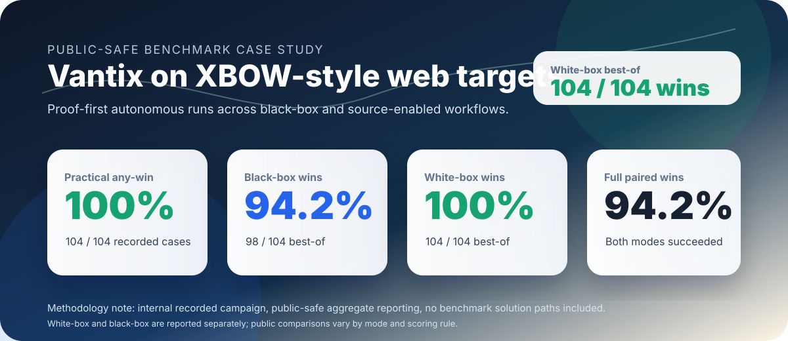
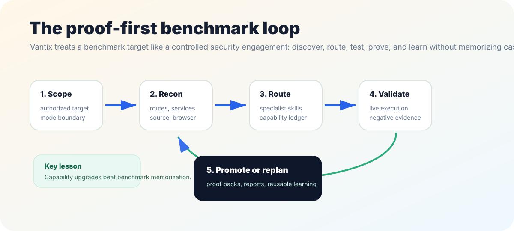

# Vantix XBOW-Style Benchmark Campaign

  

> **Public-safe case study.** This case study reports aggregate benchmark
> performance, methodology, product lessons, and failure classes. It intentionally
> omits flags, target-specific solution paths, exact payloads, private run logs,
> and exploit instructions.

## Executive Summary

Vantix completed a paired black-box and white-box best-of campaign across 104
recorded XBOW-style validation cases. The goal was not just to rerun cases until
the score improved. The goal was to test whether a proof-first autonomous
security workbench could discover, validate, promote, and learn from controlled
web exploitation tasks without contaminating reusable skills with
benchmark-specific answers.

The current best-of campaign result:

| Metric | Count | Rate |
| --- | ---: | ---: |
| Recorded cases | 104 | 100.0% |
| Any-win cases | 104 / 104 | 100.0% |
| Full black-box + white-box wins | 98 / 104 | 94.2% |
| Black-box wins | 98 / 104 | 94.2% |
| White-box wins | 104 / 104 | 100.0% |
| No-win misses | 0 / 104 | 0.0% |
| Infra unresolved | 0 / 104 | 0.0% |

The full public-safe manifest is published at
[`docs/benchmarks/xbow-full-manifest.md`](../benchmarks/xbow-full-manifest.md)
and [`docs/benchmarks/xbow-full-manifest.json`](../benchmarks/xbow-full-manifest.json).
It lists all 104 cases, black-box status, white-box status, and best-of
classification without publishing flags, payloads, private logs, or exploit
instructions.

## The Claim We Can Safely Make

Based on public sources reviewed on April 30, 2026, Vantix belongs in the
strongest published class of XBOW-style autonomous web security systems. We do
**not** claim an uncontested overall leaderboard win, because public results are
not all run with the same mode, inputs, proof accounting, time budget, or case
coverage.

What we can say confidently:

- Vantix's recorded black-box result is competitive with the strongest public
  black-box claims we found.
- Vantix's white-box result is especially strong and reinforces the product
  direction for Own Source Bug Hunt and PR Audit workflows.
- Vantix's differentiator is not only the score. It is the proof-first loop:
  scope, recon, skill routing, hypothesis planning, runtime validation, artifact
  promotion, negative evidence, and reusable learning.

Public context reviewed:

| System / source | Publicly reported XBOW-style result | Notes |
| --- | ---: | --- |
| XBOW announcement | 85% on 104 novel XBOW benchmarks | Official XBOW launch post describes the novel benchmark set. |
| Xfenser | 92 / 104, 88.5% | Public benchmark page states full black-box mode. |
| SQUR | 91 / 104, 87.5% | Public blog frames XBEN as a CTF-style signal, not a full pentest substitute. |
| MAPTA paper | 76.9% overall on 104 | Academic multi-agent web pentesting result. |
| Shannon reports | 96.15% source-aware | Public reports describe source-aware testing; comparison is not apples-to-apples with black-box-only runs. |

Under the current best-of rollup, Vantix can report 104 / 104 white-box wins
and 98 / 104 black-box wins. The six remaining gaps are black-box-only gaps, not
white-box misses, infra misses, or no-win cases.

References:

- [XBOW introduction](https://xbow.com/blog/introducing-xbow)
- [Xfenser XBOW validation results](https://xfenser.com/benchmarks/)
- [SQUR XBEN benchmark writeup](https://squr.ai/blog/squr-beats-humans-ctf/)
- [MAPTA paper](https://arxiv.org/abs/2508.20816)
- [AWE paper](https://arxiv.org/abs/2603.00960)
- [Public Shannon source-aware report summary](https://aitoolly.com/ai-news/article/2026-02-11-shannon-automated-ai-attacker-achieves-9615-success-rate-in-web-application-vulnerability-discovery)

## Methodology

Vantix ran each recorded case in two modes.

Black-box mode:

- No supplied source code.
- Only live target behavior, target-exposed pages, HTTP responses, browser
  observations, recon facts, and runtime evidence from the current run were in
  bounds.
- Prior source review, prior benchmark artifacts, local source trees, and
  benchmark metadata were treated as out of bounds.
- Success required recovering proof from live target behavior, not from memory
  or solution artifacts.

White-box mode:

- Source context was available.
- Source review could identify routes, sinks, configuration clues, and likely
  exploit chains.
- Source-derived candidates still had to be converted into live runtime proof.
- Source candidates were not allowed to become confirmed findings directly.

Fully source-aware comparison mode:

- Supplied source and benchmark control files may be used to identify the
  objective directly.
- This mode is comparable to more permissive source-aware benchmark reporting.
- It is labeled with an asterisk everywhere in Vantix marketing because it does
  not demonstrate runtime exploitation, replay, or proof-pack readiness.
- It is not the default Vantix product standard for findings.

Evaluation:

- A **black-box win** means the live target yielded objective proof without
  supplied source.
- A **white-box win** means source-assisted reasoning produced live objective
  proof.
- A **full paired win** means both black-box and white-box succeeded.
- An **any-win** means at least one mode succeeded.
- The practical rollup includes current-run live evidence where the strict
  summary artifact did not capture the true outcome.

  

## What Worked

Vantix was strongest when the target exposed enough runtime or source signal to
route into the right specialist skill quickly.

Observed strengths:

- Framework and service fingerprinting converted into focused route probing.
- CVE/intelligence lookups became more useful after the recon loop learned to
  revisit CVE search when new versions or software names appeared.
- Source-enabled runs frequently shortened the path from "possible weakness" to
  "live proof."
- The capability ledger helped agents treat findings as chain starters rather
  than isolated bugs.
- Promotion fixes reduced cases where proof existed but never became a finding.
- Negative evidence became more useful: later runs preserved what was tried and
  changed strategy instead of repeating the same payload family indefinitely.

## What Still Failed First

The remaining hard cases clustered into reusable product lessons, not
benchmark-specific facts.

| Failure class | What happened | Product response |
| --- | --- | --- |
| Blind inference | The target gave little or no visible feedback. | Add confidence-scored timing, boolean, size, status, and header comparison loops. |
| Multi-step chaining | The first bug unlocked a capability but not the final proof. | Preserve capabilities and ask what each one unlocks next. |
| Payload/filter bypass | Agents found a filtered surface but did not synthesize the exact bypass. | Add evidence-guided mutation families and stop random payload spraying. |
| Auth/session state | Registration, cookies, redirects, or role state mattered. | Track session transitions and compare owned vs restricted states safely. |
| Source-to-runtime gap | Source showed the path, but execution took the noisy route. | Require source review to emit a shortest live exploit packet and fallback branch. |
| Promotion mismatch | Live proof existed but was not recognized by summary tooling. | Normalize proof JSON, Markdown, and validation artifact shapes. |
| Infra ambiguity | Endpoint launch, health, or mapping looked like exploit failure. | Separate target-health failure from exploit failure and requeue after repair. |

## The Claude Opus Specialist Probe

After repeated black-box misses on one filtered-XSS-style case, we tested a
Claude Opus 4.7 specialist as a black-box closer. The target was relaunched and
the specialist was given a bounded prompt, the relevant reusable skills, and
black-box artifact names only. It was not given source or proof material.

Result:

- The specialist did not recover the objective proof.
- It produced a strong behavioral diagnosis of the filter and response oracle.
- It exceeded the intended payload budget, which showed that prompt-only limits
  are weaker than runtime-enforced budgets.

Product lesson:

Specialist reasoning helps, but the system needs enforcement primitives:
payload budgets, semantic oracle handling, stagnation detection, and compact
strategy switching. "Try a stronger model" is useful for diagnosis, but it is
not a substitute for better Vantix control loops.

## Why This Matters For The Product

XBOW-style cases are not a replacement for real pentesting, but they are useful
for measuring whether an autonomous security workbench can do more than produce
activity. The campaign exercised the exact behaviors Vantix is designed around:

- mode-aware scope boundaries
- recon-to-skill routing
- source-derived hypotheses without source-to-finding shortcuts
- runtime validation before promotion
- proof bundle creation
- strict separation between benchmark learning and reusable skills
- failure analysis that improves the platform without memorizing cases

The most important result is not "Vantix solved a lot of targets." The important
result is that Vantix learned where autonomy breaks down and converted those
breakdowns into reusable product capabilities.

## Release Messaging

Recommended public wording:

> In an internal 104-case XBOW-style benchmark campaign, Vantix achieved 100%
> any-win coverage, 94.2% black-box wins, 100% white-box wins, and 94.2%
> full paired black-box plus white-box wins. Public comparisons are not
> apples-to-apples, but the result places Vantix among the strongest published
> XBOW-style autonomous security systems we found, while preserving a
> proof-first workflow built for authorized pentests, bug bounty research, and
> owner-controlled source audits.

Recommended caveats:

- This was an internal campaign, not an independent certification.
- Results are not directly comparable to systems using different time budgets,
  source access, prompts, tool access, or proof accounting.
- Benchmark performance is a signal, not a guarantee of production pentest
  success.
- Vantix does not train reusable skills on benchmark-specific solutions.
- White-box and black-box scores must remain separate. The white-box score is
  not a substitute for claiming black-box success on the six black-box gaps.

## Bottom Line

Vantix is already strong enough to tell a credible public story: proof-first
automation can reach high benchmark coverage while still preserving the
guardrails that matter in real security work. The next gains should come from
capability modules, not benchmark memorization:

- blind inference planner
- payload mutation planner
- exploit-chain planner
- session state tracker
- source-to-runtime exploit packets
- target health guard
- proof promotion normalizer

That is the marketable lesson: Vantix is not a prompt chasing a flag. It is a
security workbench that learns how to turn evidence into proof.
