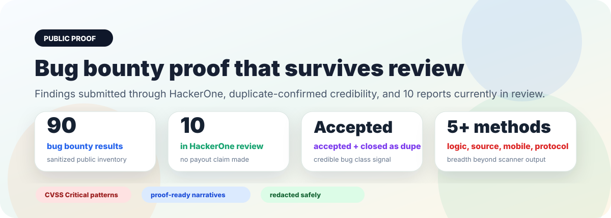

# Public Case Studies

Vantix public proof material has three tracks. Real bug bounty material is
sanitized because it comes from non-disclosable targets. OWASP Juice Shop
material is published in full because it is a safe benchmark target. XBOW-style
benchmark material is published as aggregate, public-safe methodology and
performance analysis without solution paths.

  

## Featured proof pages

- [Bug Bounty Proof Pack](case-studies/bug-bounty-proof.md) — top-value public-safe patterns from the redacted bug bounty corpus, including reports submitted through HackerOne, accepted/closed-as-duplicate outcomes, and 10 currently in review.
- [XBOW-Style Benchmark Campaign](case-studies/xbow-benchmark-campaign.md) — public-safe 104-case internal campaign summary with 98 / 104 black-box wins, 104 / 104 white-box wins, and a full case manifest.
- [OWASP Juice Shop Proof Pack](case-studies/juice-shop-proof.md) — full, unredacted black-box and white-box benchmark reports on a reproducible intentionally vulnerable target. Current source defines 111 challenges; latest Vantix validation covers 35 live runtime finding items and 58 source-aware finding/candidate items, leaving 76 runtime-only and 53 source-aware challenge-equivalent gaps.
- [Vantix Public Case Study V5](case-studies/vantix_public_case_study_v5.md) — 90 preserved findings across web/API, consensus, value-transfer protocol, Android/mobile, cloud/network configuration, and application logic.

## Full inventories and reports

- [Redacted Bug Bounty Pattern Inventory](case-studies/redacted-bug-bounty-patterns.md)
- [XBOW Benchmark Marketing Page](marketing/xbow-benchmark-campaign.html)
- [OWASP Juice Shop Black-Box Reference Report](examples/juice-shop-blackbox-report.md)
- [OWASP Juice Shop White-Box Reference Report](examples/juice-shop-whitebox-report.md)

## Sanitization rules for bug bounty material

Real bug bounty case studies may include:

- root cause
- affected class of component
- safe reproduction concept
- severity and CVSS vector
- proof style
- remediation theme
- business/security impact

Real bug bounty case studies must not include:

- target names
- exact routes, domains, packages, or customer identifiers
- report links or report IDs
- secrets, tokens, cookies, hashes, credentials
- private screenshots or raw captures
- reusable exploit instructions

These restrictions do not apply to OWASP Juice Shop benchmark reports. Those
reports can include full routes, payloads, findings, and source references
because the target is intentionally vulnerable training software. XBOW-style
campaign docs remain aggregate-only because benchmark solution paths should not
be shipped as reusable public material.

## Outcome wording

The public bug bounty docs may say the corpus includes reports submitted through
HackerOne, accepted/closed-as-duplicate outcomes, and 10 reports currently in
review. They must not claim paid bounty awards, name programs, expose report IDs,
or disclose private target details.

## Why this matters

A useful case study should be credible without being dangerous. Vantix reports are built to preserve proof internally while exporting only what is safe and appropriate for the audience.
